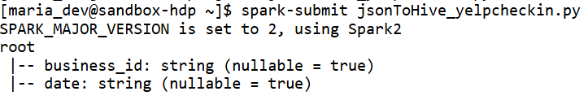
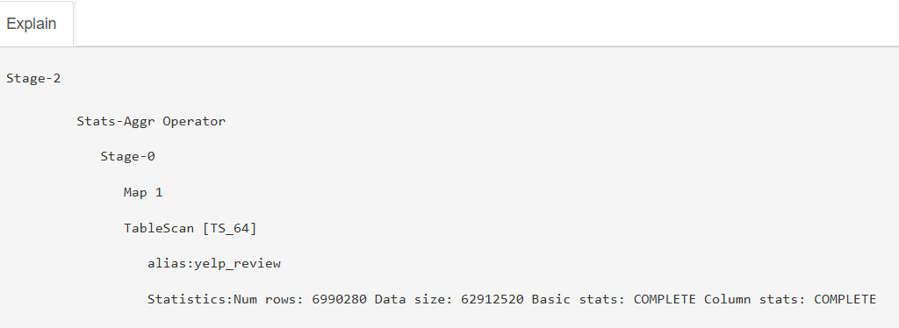

```{r setup, include=FALSE}
knitr::opts_chunk$set(echo = TRUE)
```

For an interactive HTML version of this document, click this link:

#  {.tabset}

## 1. Introduction {.tabset .tabset-pills}

### \*

The dataset was sourced from Yelp. In the initial compressed file is another .tar file which contains the dataset. The yelp_dataset.tar file contains 5 JSON files; business.json, checkin.json, tip.json, user.json, review.json.

The business.json contains information related to the business including its location and some of its attributes. The reviews.json contains the actual text of the reviews and its associated rating and other information. The users.json contains information about Yelp's userbase including their friend network along with associated information about votes and compliments submitted to that user by other users.

The files not used in this analysis are described as below: The checkin.json contains businesses and a list of timestamps of each checkin; check-ins are a way for people to keep track of places they've visited to their friend network. The tip.json is similar to review.json, but instead of a more involved text review, a tip is just more similar to one-liners to convey a quick message.

Hive was used to store the large files (difficult or impossible to store) and data exploration. Python was used to connect Hive to R in an easy way and to have access to Python's functionality. RStudio was used for pre-processing, data analysis and visualisation. R Markdown was used since its has more functionality and ease-of-use as a text editor compared to Jupyter Notebook such as copy pasting images directly from clipboard while having options to produce a HTML document or a Github Document.

### 1.1 Objectives

-   Use the Hadoop ecosystem to store, query and access the database into R.

-   Identify top-rated businesses - determine which businesses receive the highest ratings overall, in specific categories (e.g., restaurants, cafes, hair salons), or in a location.

-   Find Common Keywords in Positive and Negative Reviews To extract and analyze frequently used keywords in high-rated vs. low-rated reviews to understand common customer praises and complaints.

-   Analyze customer sentiment of Yelp reviews across different businesses using text-based analysis, and make recommendations based on that.

-   Conduct a network analysis of reviewers and their followers to analyze whether influence on followers such as review count and rating.

### 1.2 Summary of business.json

Below is a summary of the original columns and the type of data that was stored inside. For columns that were JSON object structures (struct), they had to be expanded out as well.

| Name | Description | Data type |
|---------------|-------------------------------------------|---------------|
| business_id | A 22-character string containing a uinque ID for the business - used to connect reviews, category | string |
| name | The name of the business | string |
| address | The address of the business | string |
| city | The city where the business is located | string |
| state | The state code where the business is located | string |
| postal code | The postal code where the business is located | string |
| latitude | The latitude of where the business is located | float |
| longitude | The longitude of where the business is located | float |
| stars | Average rating, rounded to half-stars | float |
| review_count | total number of reviews | float |
| is_open | Whether is it closed (0) or open (1) | boolean |
| attributes | Has several logical variables related | struct |
| categories | Related to what category the business is | string array |
| hours | Opening hours for each day of the week | struct |

### 1.3 Summary of review.json

| Name | Description | Data type |
|----------------|-----------------------------------------|----------------|
| review_id | 22-character unique review ID | string |
| user_id | ID for the user that wrote the review - maps to user.json | string |
| business_id | ID of the business the review is for - maps to business.json | string |
| stars | Rating out of 5 | integer |
| date | Date the review was submitted | string |
| text | The actual review text itself | string |
| useful | Number of 'useful' votes received from other users | integer |
| funny | Number of 'funny' votes received from other users | integer |
| cool | Number of 'cool' votes received from other users | integer |

### 1.4 Summary of user.json

| Name | Description | Data type |
|--------------|--------------------------------------------|--------------|
| user_id | 22-character unique user ID - maps to review.json | string |
| name | Name of the user's first name | string |
| review_count | number of reviews they've written | integer |
| yelping_since | The date the user registered on Yelp | string |
| friends | List of user's friends - friends are mutual followers | string array |
| useful | Number of 'useful' votes received from other users |  |
| funny | Number of 'useful' votes received from other users |  |
| cool | Number of 'useful' votes received from other users |  |
| fans | Number of fans - Fans are other users |  |
| elite | Years where a user was 'elite'. An 'Elite' member is someone recognised by Yelp to be trusted reviewers. |  |
| average_stars | Average star rating |  |
| compliment\_\* | 11 columns defined by the number of \* compliments received by the user where \* is hot, more, profile, cute, list, note, plain, cool, funny, writer, photo | 11 columns |

## 2. Data Storage and Pre-processing {.tabset .tabset-pills}

### 2.1 Data Storage Using Hadoop

Since reviews and users are very large (5GB and 3GB respectively), they cannot easily be manipulated in R or Python. Because of those files in particular, all 5 JSON files had to be moved to the virtualbox maria_dev folder using [WinSCP](https://winscp.net/eng/download.php). Then all the files were converted into Hive tables using Spark.

An example of a script using Spark.

```{python eval=FALSE}
from pyspark.sql import SparkSession

spark = SparkSession.builder \
    .appName("JSON Schema Viewer") \
    .getOrCreate()
df = spark.read.json("C:/Users/Documents/a_ncw/2manage/yelp_academic_dataset_business.json")
df.printSchema()
```


Another example of checkin's schema when turning the checkin json to a hive table. 

### 2.2 Setting up the Workstation

Since there was a specially made environment made to interact with the hadoop framework, the conda environment has to be set to that from whatever the default was.

```{r}
reticulate::use_condaenv(condaenv ="C:/ProgramData/anaconda3/envs/ukm_stqd6324",required = TRUE)
```

Then after that, comes importing all the libraries, setting up a connection can be made via python for Hive querying and R for any further pre-processing and visualisation. Overall, after the data has been properly converted to JSON to Hive table, the flow of the data is Apache Hive -\> Python -\> R.

```{python}
import pandas as pd
from impala.dbapi import connect

conn = connect(
    host='127.0.0.1',
    port=10000,
    user='maria_dev',
    database='default',
    auth_mechanism = 'PLAIN'
)
cursor = conn.cursor()

# A function was made to simplify converting Hive queries to pandas dataframes.
def to_pd(cursor):
  columns = [desc[0] for desc in cursor.description]
  data = cursor.fetchall()
  return pd.DataFrame(data, columns=columns)
```

When looking at all the databases stored in Hive, I uploaded the following tables. The names match the name of aforementioned JSON files described before. *yelp_business_category* is a table based on the 'category' column in yelp_business.

```{python eval=FALSE}
cursor.execute('SHOW TABLES')
print(cursor.fetchall())
```

### 2.3 Example of querying

1.  Connect and run SQL query in python and turn it into a pd dataframe.

```{python}
cursor.execute('SELECT * FROM yelp_review LIMIT 10')

# Fetch column names and rows
columns = [desc[0] for desc in cursor.description]

# Store as pandas DataFrame
yelp_df = pd.DataFrame(cursor.fetchall(), columns=columns)
yelp_df
```

2.  After, using the reticulate package and py\$, transfer it over as an R object for further data manipulation

```{r}
a<-as.data.frame(reticulate::py$yelp_df)
a
```

This is the columns

```{python eval=FALSE}
cursor.execute('DESCRIBE EXTENDED yelp_business')
print(cursor.fetchall())
```

Exploratory Data Analysis, when selecting for name of business and id, we ordered by stars in descending order followed by review_count in descending order, ensuring only businesses with the highest rating from the highest number of reviews is displayed.

```{python eval=FALSE}
cursor.execute('SELECT name, business_id, stars, review_count FROM yelp_business ORDER BY stars DESC, review_count DESC LIMIT 10')
print(cursor.fetchall())
```

After that, when we look at the columns for yelp_review:

```{python}
cursor.execute('DESCRIBE yelp_review')
print(cursor.fetchall())
```

When running `ANALYZE TABLE yelp_review COMPUTE STATISTICS;` in Ambari's Hive's Query Editor and clicking Explain, we see that the number of reviews is 6990280, matching the number of reviews as mentioned on the Yelp website.



```{python}
cursor.execute("describe extended yelp_review")
print(cursor.fetchall())
```

```{python}
cursor.execute('DESCRIBE extended yelp_user')
print(cursor.fetchall())
```

## 3.0 Pre-processing {.tabset .tabset-pills}

### Business.json

When looking at businesses overall, there are 58 columns.

```{python}
cursor.execute('DESCRIBE yelp_business')
print(cursor.fetchall())
cursor.execute('SELECT COUNT(*) FROM yelp_business')
print(cursor.fetchall())
```

```{python}
cursor.execute("SELECT * FROM yelp_business LIMIT 10")
columns = [desc[0] for desc in cursor.description]
df = pd.DataFrame(cursor.fetchall(),columns=columns)
df
```

Of which, 39 come from the 'attributes' object.
```{python}
df_attributes = df.filter(regex='^yelp_business.attributes')
print(df_attributes.columns)
df_attributes
```

And 7 come from 'hours'.
```{python}
df_attributes = df.filter(regex='^yelp_business.hour')
print(df_attributes.columns)
df_attributes
```

For the sake of the analysis, all irrelevant columns has to be removed. In addition, since the aim of this assignment is to make recommendations for a poorly-performing one, I only want to focus on active businesses, not businesses are closed. In addition, I want to focus on businesses that have at least 30 reviews.

In Ambari Hive, I make a new View based on the original table.
```{python eval=FALSE}
DROP VIEW bus_view;

CREATE VIEW bus_view AS
SELECT business_id, name, review_count, stars, address, state, city, latitude, longitude
FROM yelp_business
WHERE is_open = 0 AND review_count >= 30;
```

So from, 150,000 businesses, only 9235 are from currently open businesses with a review count of at least 30. 
```{python eval=FALSE}
cursor.execute("SELECT COUNT(*) from yelp_business")
print(cursor.fetchall()) #150246 rows
cursor.execute("SELECT COUNT(*) from bus_view")
print(cursor.fetchall()) #9235 rows
```
## 4.0 Exploratory data analysis {.tabset .tabset-pills}

### Average star rating for all businesses

Out of all the stars rating, only nine values are possible since Yelp only displays it rounded to the nearest 0.5. 
```{python}
cursor.execute("SELECT stars, COUNT(*) AS freq, AVG(review_count) AS avg_review_count FROM yelp_business GROUP BY stars ORDER BY freq DESC")
df = to_pd(cursor)
df
```

Overall, there is a left skew where most businesses are rated more positively than negatively. The most common rating on average for a particular business is around 4, followed by 4.5 and 3.0. The highest rating only occurs around 10.8% of the time.
```{r echo=FALSE}
library(ggplot2)
library(dplyr)

df<-reticulate::py$df

# Plot the bar chart
ggplot(df, aes(x = stars, y = freq)) +
  geom_bar(stat = "identity", fill = "darkseagreen") +
  labs(
    title = "Distribution of Star Ratings",
    x = "Star Rating",
    y = "Number of Reviews"
  ) +
  theme_minimal()
```

The x-axis is the rating, the left y-axis points to the frequency of the rating and the right y-axis is the average review count of a business with that rating. The green is number of businesses with that star rating and blue is average number of reviews for all businesses per star rating. 

As can be seen, it does not follow the same proportion for the frequency. The top three highest average review counts are the same as the business count, but the two lowest are 1.0 and 5.0, which shows that most businesses with either a consistently high or low rating tend to have fewer reviews. This suggests that extreme ratings are pushed forward by a small number of reviews. As in, for example, if talking about it in a generalised overview, while businesses with a high 5-star rating would typically be seen as 'better' than those rated under 5, but in actuality, taking in account the difference in average review count vs rating, it could actually signify a business that is just niche or new instead of better.
```{r}
df<-reticulate::py$df
ff <- max(df$freq) / max(df$avg_review_count)

ggplot(df, aes(x = stars)) +
  geom_col(aes(y = freq), fill = "darkseagreen", alpha = 0.7) +
  geom_col(aes(y = avg_review_count * ff), fill = "blue", alpha = 0.2) +
  scale_y_continuous(
    name = "Business Count",
    sec.axis = sec_axis(~ . / ff, name = "Average Review Count")
  ) +
  labs(
    title = "Business Count vs. Average Review Count by Star Rating",
    x = "Star Rating"
  ) +
  theme_minimal()
```


### Distribution of review count
```{python}
cursor.execute("SELECT review_count, name, city, categories FROM yelp_business ORDER BY review_count DESC")
df = to_pd(cursor)
df
```

Looking at all businesses, it's clear the review count is heavily right-skewed. The max is 7568, while the minimum number of reviews is only 5, yet the average number of reviews for any business in this dataset is only around 45.
```{r warning = FALSE}

df<-reticulate::py$df

# Plot the bar chart
ggplot(df, aes(x = review_count)) +
  geom_histogram(bins=50,fill = "darkorange", color = "white") +
  geom_vline(aes(xintercept = mean(df$review_count)), colour = "blue") +
  annotate("text",
           x = mean(df$review_count),
           y = 10,  # places label at the top of the plot
           label = paste("Mean =", round(mean(df$review_count),1)),
           vjust = 1.2, hjust = -0.2,
           color = "blue", fontface = "bold") +
  xlim(0, 300) +
  labs(
    title = "Histogram of Review Counts",
    x = "Number of Reviews",
    y = "Frequency"
  ) +
  theme_minimal()
```

Amazingly, around a third of businesses on Yelp do not even hit 10 reviews
```{r}
sum(df$review_count < 10)
```
Overall, out of all the businesses that have at least 500 reviews are mostly from the US, namely cities such as Philadelphia, New Orleans, Nashville. This could be because they are well-known tourist destinations. Since these cities attract many visitors throughout the year, it most likely leads to a higher number of customers leaving reviews for businesses (restaurants, hotels, tourist attractions, etc.). However, take note that this Yelp dataset only covers 11 metropolitan areas, which is why other popular tourism cities like New York do not appear at all.

High foot traffic due to tourism and popular events (e.g., Mardi Gras in New Orleans or music festivals in Philadelphia and Nashville) could be contributing to the higher review count.
```{r}
df<-reticulate::py$df
df2 <- df %>% filter(review_count > 500)
gg<-sort(table(df2$city), decreasing = TRUE)[1:20]
gg
```

```{r}
ggplot(as.data.frame(gg), aes(x = reorder(Var1, -Freq), y = Freq)) +
  geom_bar(stat = "identity") +
  labs(
    title = "City of Businesses with at least 500 reviews",
    x = "City",
    y = "Frequency"
  ) +
  theme_minimal() +
  theme(axis.text.x = element_text(angle = 90, hjust = 1))
```
```{python}
cursor.execute("SELECT ybc.business_id, ybc.category FROM yelp_business AS yb JOIN yelp_business_category AS ybc ON yb.business_id = ybc.business_id WHERE yb.city = 'New Orleans' AND yb.review_count >= 1000")
df = to_pd(cursor)
df
```

For those with a high review count in New Orleans, the categories associated with it is Cajun/Creole and Seafood.
```{r echo=FALSE}
df<-reticulate::py$df
gg<-sort(table(df$ybc.category), decreasing = TRUE)[1:20]
gg
```
```{python}
cursor.execute("SELECT ybc.business_id, ybc.category FROM yelp_business AS yb JOIN yelp_business_category AS ybc ON yb.business_id = ybc.business_id WHERE yb.city = 'Nashville' AND yb.review_count >= 1000")
df = to_pd(cursor)
df
```

For those with a high review count in Nashville, the categories associated with it is similar to those in Philadelphia.
```{r echo=FALSE}
df<-reticulate::py$df
gg<-sort(table(df$ybc.category), decreasing = TRUE)[1:20]
gg
```
```{python}
cursor.execute("SELECT ybc.business_id, ybc.category FROM yelp_business AS yb JOIN yelp_business_category AS ybc ON yb.business_id = ybc.business_id WHERE yb.city = 'Philadelphia' AND yb.review_count >= 1000")
df = to_pd(cursor)
df
```

For those with a high review count in New Orleans, the categories associated with it is Cajun/Creole and Seafood.
```{r echo=FALSE}
df<-reticulate::py$df
gg<-sort(table(df$ybc.category), decreasing = TRUE)[1:20]
gg
```

### Distribution of categories

Looking at the category column, there are a total of 1310 unique values this could be. These columns are not distinct per business so a single business could belong to multiple categories.
```{python}
cursor.execute("SELECT category, COUNT(*) AS frequency FROM yelp_business_category GROUP BY category ORDER BY frequency DESC")
df = to_pd(cursor)
df
```
```{r}
df<-reticulate::py$df
mean(df$frequency) #average is 509.9863
```
Around one third of businesses in this dataset is categorised under Restaurant, followed by businesses related to Home Services, Beauty & Spa, Nightlife and Health & Medical.
```{r}
ggplot(df, aes(x = reorder(category, -frequency), y = frequency)) +
  geom_bar(stat = "identity") +
  labs(
    title = "Frequency of Business Categories",
    x = "Category",
    y = "Frequency"
  ) +
  theme_minimal() +
  coord_cartesian(xlim=c(0,50)) +
  theme(axis.text.x = element_text(angle = 90, hjust = 1))
```

## 5.0 Text Mining Analysis


### Discussion

## 6.0 User Friendship Network Analysis

### Discussion
