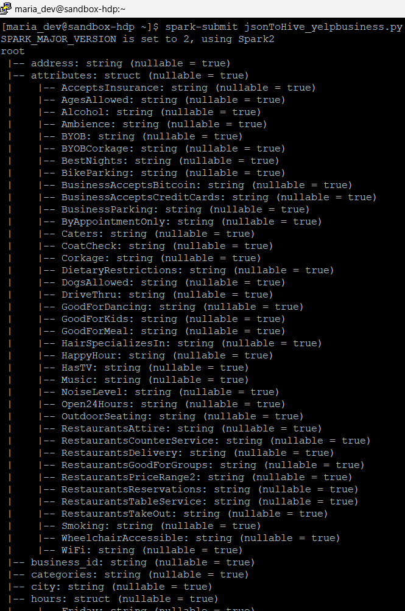

```{r setup, include=FALSE}
knitr::opts_chunk$set(echo = TRUE)
```

## R Markdown

This is an R Markdown document. Markdown is a simple formatting syntax for authoring HTML, PDF, and MS Word documents. For more details on using R Markdown see <http://rmarkdown.rstudio.com>.

When you click the **Knit** button a document will be generated that includes both content as well as the output of any embedded R code chunks within the document. You can embed an R code chunk like this:

```{r cars}
a<-5
print(a)
```

## Including Plots

You can also embed plots, for example:

```{r pressure, echo=FALSE}
plot(pressure)
```

Note that the `echo = FALSE` parameter was added to the code chunk to prevent printing of the R code that generated the plot.

## 1.0 INTRODUCTION

The dataset was sourced from Yelp. In the initial compressed file is another .tar file which contains the dataset. The yelp_dataset.tar file contains 5 JSON files; business.json, checkin.json, tip.json, user.json, review.json.

The business.json contains the following information

## DATA STORAGE

After unzipping the initial zip file from Yelp, there is another file inside which is the tar file containing all the json files.

```{r}
#after setting working directory
untar("~/a_ncw/2manage/yelp_dataset.tar")
```

After that, to read the json file into a dataframe for RStudio.

```{r}
library(jsonlite)
```

```{r}
yelp_biz <- stream_in(file("yelp_academic_dataset_business.json"), verbose = TRUE)
```

```{r}
library(jsonlite)
yelp_tip<-stream_in(file("yelp_academic_dataset_tip.json"), verbose = TRUE)
```

```{r}
saveRDS(yelp_biz, file = "yelp_biz.RDS")
saveRDS(yelp_tip, file = "yelp_tip.RDS")
saveRDS(yelp_tip, file = "yelp_checkin.RDS")
```

When using reticulate, since there was a specially made environment made to interact with Hive, the conda environment has to be set to that from whatever the default was.

```{r}
reticulate::use_condaenv(condaenv ="C:/ProgramData/anaconda3/envs/ukm_stqd6324",required = TRUE)
```

After setting up the virtual machine, and putty, connect can be made via python.

```{python}
import pandas as pd
from impala.dbapi import connect

conn = connect(
    host='127.0.0.1',
    port=10000,
    user='maria_dev',
    database='default',
    auth_mechanism = 'PLAIN'
)
cursor = conn.cursor()
```

When looking at all the databases stored in Hive, the tables we stored are in default.

```{python}
cursor.execute('SHOW DATABASES')
print(cursor.fetchall())
```

Since reviews and users are very large (5GB and 3GB respectively), they cannot easily be manipulated in R or Python. So, the files were moved to the virtualbox maria_dev folder using [WinSCP](https://winscp.net/eng/download.php) to transfer all 5 JSON files over. Then all the files were converted into Hive tables using Spark.

```         
```



Another example: when turning the checkin json to a hive table.


## Example of querying

1.  Connect and run SQL query in python and turn it into a pd dataframe.

```{python}
cursor.execute('SELECT * FROM yelp_review LIMIT 10')

# Fetch column names and rows
columns = [desc[0] for desc in cursor.description]

# Store as pandas DataFrame
yelp_df = pd.DataFrame(cursor.fetchall(), columns=columns)
yelp_df
```

2.  After, using the reticulate package and py\$, transfer it over as an R object for further data manipulation

```{r}
a<-as.data.frame(reticulate::py$yelp_df)
a
```

This is the columns

```{python}
cursor.execute('DESCRIBE yelp_business')
print(cursor.fetchall())
```

Exploratory Data Analysis, when selecting for name of business and id, we ordered by stars in descending order followed by review_count in descending order, ensuring only businesses with the highest rating from the highest number of reviews is displayed.

```{python}
cursor.execute('SELECT name, business_id, stars, review_count FROM yelp_business ORDER BY stars DESC, review_count DESC LIMIT 10')
print(cursor.fetchall())
```

After that, when we look at the columns for yelp_review:

```{python}
cursor.execute('DESCRIBE yelp_review')
print(cursor.fetchall())
```

When running `ANALYZE TABLE yelp_review COMPUTE STATISTICS;` in Ambari's Hive's Query Editor and clicking Explain, we see that the number of reviews is 6990280, matching the number of reviews as mentioned on the Yelp website.


```{python}
cursor.execute('SELECT b.name, b.business_id, AVG(r.stars) AS avg_rating, COUNT(*) AS num_reviews FROM yelp_business b JOIN yelp_review r ON b.business_id = r.business_id GROUP BY b.name, b.business_id ORDER BY avg_rating DESC, num_reviews DESC LIMIT 10')
print(cursor.fetchall())
```

```{python}
cursor.execute("describe extended yelp_review")
print(cursor.fetchall())
```

```{python}
cursor.execute('DESCRIBE extended yelp_user')
print(cursor.fetchall())
```

I;m not sure

```{python}
cursor.execute('SELECT id, name, fans, review_count FROM yelp_user ORDER BY fans DESC LIMIT 10')
print(cursor.fetchall())
```

## References
