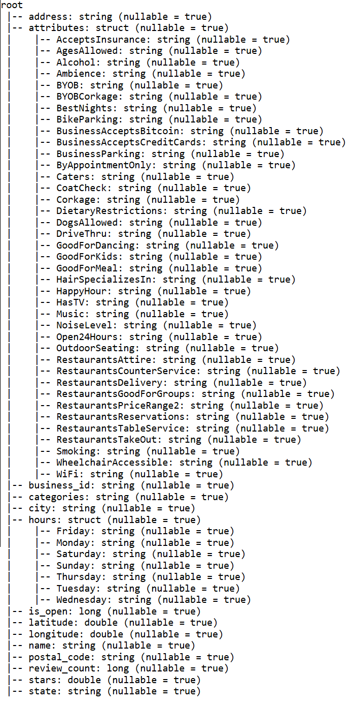

Using Text Mining Analysis and User Network Analysis to Improve the
Rating of a Poorly-Performing Business
================
Ng Chin Wen
2025-05-11

For an interactive HTML version of this document, click this link:

# 

## 1. Introduction

### \*

The dataset was sourced from Yelp. In the initial compressed file is
another .tar file which contains the dataset. The yelp_dataset.tar file
contains 5 JSON files; business.json, checkin.json, tip.json, user.json,
review.json.

The business.json contains information related to the business including
its location and some of its attributes. The reviews.json contains the
actual text of the reviews and its associated rating and other
information. The users.json contains information about Yelp’s userbase
including their friend network along with associated information about
votes and compliments submitted to that user by other users.

The files not used in this analysis are described as below: The
checkin.json contains businesses and a list of timestamps of each
checkin; check-ins are a way for people to keep track of places they’ve
visited to their friend network. The tip.json is similar to review.json,
but instead of a more involved text review, a tip is just more similar
to one-liners to convey a quick message.

Hive was used to store the large files (difficult or impossible to
store) and data exploration. Python was used to connect Hive to R in an
easy way and to have access to Python’s functionality. RStudio was used
for pre-processing, data analysis and visualisation. R Markdown was used
since its has more functionality and ease-of-use as a text editor
compared to Jupyter Notebook such as copy pasting images directly from
clipboard while having options to produce a HTML document or a Github
Document.

### 1.1 Objectives

- Use the Hadoop ecosystem to store, query and access the database into
  R.

- Identify top-rated businesses - determine which businesses receive the
  highest ratings overall, in specific categories (e.g., restaurants,
  cafes, hair salons), or in a location.

- Find Common Keywords in Positive and Negative Reviews To extract and
  analyze frequently used keywords in high-rated vs. low-rated reviews
  to understand common customer praises and complaints.

- Analyze customer sentiment of Yelp reviews across different businesses
  using text-based analysis, and make recommendations based on that.

- Conduct a network analysis of reviewers and their followers to analyze
  whether influence on followers such as review count and rating.

### 1.2 Summary of business.json

Below is a summary of the original columns and the type of data that was
stored inside. For columns that were JSON object structures (struct),
they had to be expanded out as well.

| Name | Description | Data type |
|----|----|----|
| business_id | A 22-character string containing a uinque ID for the business - used to connect reviews, category | string |
| name | The name of the business | string |
| address | The address of the business | string |
| city | The city where the business is located | string |
| state | The state code where the business is located | string |
| postal code | The postal code where the business is located | string |
| latitude | The latitude of where the business is located | float |
| longitude | The longitude of where the business is located | float |
| stars | Average rating, rounded to half-stars | float |
| review_count | total number of reviews | float |
| is_open | Whether is it closed (0) or open (1) | boolean |
| attributes | Has several logical variables related | struct |
| categories | Related to what category the business is | string array |
| hours | Opening hours for each day of the week | struct |

### 1.3 Summary of review.json

| Name | Description | Data type |
|----|----|----|
| review_id | 22-character unique review ID | string |
| user_id | ID for the user that wrote the review - maps to user.json | string |
| business_id | ID of the business the review is for - maps to business.json | string |
| stars | Rating out of 5 | integer |
| date | Date the review was submitted | string |
| text | The actual review text itself | string |
| useful | Number of ‘useful’ votes received from other users | integer |
| funny | Number of ‘funny’ votes received from other users | integer |
| cool | Number of ‘cool’ votes received from other users | integer |

### 1.4 Summary of user.json

| Name | Description | Data type |
|----|----|----|
| user_id | 22-character unique user ID - maps to review.json | string |
| name | Name of the user’s first name | string |
| review_count | number of reviews they’ve written | integer |
| yelping_since | The date the user registered on Yelp | string |
| friends | List of user’s friends - friends are mutual followers | string array |
| useful | Number of ‘useful’ votes received from other users |  |
| funny | Number of ‘useful’ votes received from other users |  |
| cool | Number of ‘useful’ votes received from other users |  |
| fans | Number of fans - Fans are other users |  |
| elite | Years where a user was ‘elite’. An ‘Elite’ member is someone recognised by Yelp to be trusted reviewers. |  |
| average_stars | Average star rating |  |
| compliment\_\* | 11 columns defined by the number of \* compliments received by the user where \* is hot, more, profile, cute, list, note, plain, cool, funny, writer, photo | 11 columns |

## 2. Data Storage and Pre-processing

### 2.1 Data Storage Using Hadoop

Since reviews and users are very large (5GB and 3GB respectively), they
cannot easily be manipulated in R or Python. Because of those files in
particular, all 5 JSON files had to be moved to the virtualbox maria_dev
folder using [WinSCP](https://winscp.net/eng/download.php). Then all the
files were converted into Hive tables using Spark.

An example of a script using Spark.

``` python
from pyspark.sql import SparkSession

spark = SparkSession.builder \
    .appName("JSON Schema Viewer") \
    .getOrCreate()
df = spark.read.json("C:/Users/Documents/a_ncw/2manage/yelp_academic_dataset_business.json")
df.printSchema()
```



Another example of checkin’s schema when turning the checkin json to a
hive table. 

### 2.2 Setting up the Workstation

Since there was a specially made environment made to interact with the
hadoop framework, the conda environment has to be set to that from
whatever the default was.

``` r
reticulate::use_condaenv(condaenv ="C:/ProgramData/anaconda3/envs/ukm_stqd6324",required = TRUE)
```

Then after that, comes importing all the libraries, setting up a
connection can be made via python for Hive querying and R for any
further pre-processing and visualisation. Overall, after the data has
been properly converted to JSON to Hive table, the flow of the data is
Apache Hive -\> Python -\> R.

``` python
import pandas as pd
from impala.dbapi import connect

conn = connect(
    host='127.0.0.1',
    port=10000,
    user='maria_dev',
    database='default',
    auth_mechanism = 'PLAIN'
)
cursor = conn.cursor()

# A function was made to simplify converting Hive queries to pandas dataframes.
def to_pd(cursor):
  columns = [desc[0] for desc in cursor.description]
  data = cursor.fetchall()
  return pd.DataFrame(data, columns=columns)
```

When looking at all the databases stored in Hive, I uploaded the
following tables. The names match the name of aforementioned JSON files
described before. *yelp_business_category* is a table based on the
‘category’ column in yelp_business.

``` python
cursor.execute('SHOW TABLES')
print(cursor.fetchall())
```

### 2.3 Example of querying

1.  Connect and run SQL query in python and turn it into a pd dataframe.

``` python
cursor.execute('SELECT * FROM yelp_review LIMIT 10')

# Fetch column names and rows
columns = [desc[0] for desc in cursor.description]

# Store as pandas DataFrame
yelp_df = pd.DataFrame(cursor.fetchall(), columns=columns)
yelp_df
```

    ##   yelp_review.business_id  ...     yelp_review.user_id
    ## 0  XQfwVwDr-v0ZS3_CbbE5Xw  ...  mh_-eMZ6K5RLWhZyISBhwA
    ## 1  7ATYjTIgM3jUlt4UM3IypQ  ...  OyoGAe7OKpv6SyGZT5g77Q
    ## 2  YjUWPpI6HXG530lwP-fb2A  ...  8g_iMtfSiwikVnbP2etR0A
    ## 3  kxX2SOes4o-D3ZQBkiMRfA  ...  _7bHUi9Uuf5__HHc_Q8guQ
    ## 4  e4Vwtrqf-wpJfwesgvdgxQ  ...  bcjbaE6dDog4jkNY91ncLQ
    ## 5  04UD14gamNjLY0IDYVhHJg  ...  eUta8W_HdHMXPzLBBZhL1A
    ## 6  gmjsEdUsKpj9Xxu6pdjH0g  ...  r3zeYsv1XFBRA4dJpL78cw
    ## 7  LHSTtnW3YHCeUkRDGyJOyw  ...  yfFzsLmaWF2d4Sr0UNbBgg
    ## 8  B5XSoSG3SfvQGtKEGQ1tSQ  ...  wSTuiTk-sKNdcFyprzZAjg
    ## 9  gebiRewfieSdtt17PTW6Zg  ...  59MxRhNVhU9MYndMkz0wtw
    ## 
    ## [10 rows x 9 columns]

2.  After, using the reticulate package and py\$, transfer it over as an
    R object for further data manipulation

``` r
a<-as.data.frame(reticulate::py$yelp_df)
a
```

    ##    yelp_review.business_id yelp_review.cool    yelp_review.date
    ## 1   XQfwVwDr-v0ZS3_CbbE5Xw                0 2018-07-07 22:09:11
    ## 2   7ATYjTIgM3jUlt4UM3IypQ                1 2012-01-03 15:28:18
    ## 3   YjUWPpI6HXG530lwP-fb2A                0 2014-02-05 20:30:30
    ## 4   kxX2SOes4o-D3ZQBkiMRfA                1 2015-01-04 00:01:03
    ## 5   e4Vwtrqf-wpJfwesgvdgxQ                1 2017-01-14 20:54:15
    ## 6   04UD14gamNjLY0IDYVhHJg                1 2015-09-23 23:10:31
    ## 7   gmjsEdUsKpj9Xxu6pdjH0g                0 2015-01-03 23:21:18
    ## 8   LHSTtnW3YHCeUkRDGyJOyw                0 2015-08-07 02:29:16
    ## 9   B5XSoSG3SfvQGtKEGQ1tSQ                0 2016-03-30 22:46:33
    ## 10  gebiRewfieSdtt17PTW6Zg                0 2016-07-25 07:31:06
    ##    yelp_review.funny  yelp_review.review_id yelp_review.stars
    ## 1                  0 KU_O5udG6zpxOg-VcAEodg                 3
    ## 2                  0 BiTunyQ73aT9WBnpR9DZGw                 5
    ## 3                  0 saUsX_uimxRlCVr67Z4Jig                 3
    ## 4                  0 AqPFMleE6RsU23_auESxiA                 5
    ## 5                  0 Sx8TMOWLNuJBWer-0pcmoA                 4
    ## 6                  2 JrIxlS1TzJ-iCu79ul40cQ                 1
    ## 7                  2 6AxgBCNX_PNTOxmbRSwcKQ                 5
    ## 8                  0 _ZeMknuYdlQcUqng_Im3yg                 5
    ## 9                  1 ZKvDG2sBvHVdF5oBNUOpAQ                 3
    ## 10                 0 pUycOfUwM8vqX7KjRRhUEA                 3
    ##                                                                                                                                                                                                                                                                                                                                                                                                                                                                                                                                                                                                                                                                                                                                                                                                                                                     yelp_review.text
    ## 1                                                                                                                                                                                                                                                                                                                                If you decide to eat here, just be aware it is going to take about 2 hours from beginning to end. We have tried it multiple times, because I want to like it! I have been to it's other locations in NJ and never had a bad experience. \n\nThe food is good, but it takes a very long time to come out. The waitstaff is very young, but usually pleasant. We have just had too many experiences where we spent way too long waiting. We usually opt for another diner or restaurant on the weekends, in order to be done quicker.
    ## 2  I've taken a lot of spin classes over the years, and nothing compares to the classes at Body Cycle. From the nice, clean space and amazing bikes, to the welcoming and motivating instructors, every class is a top notch work out.\n\nFor anyone who struggles to fit workouts in, the online scheduling system makes it easy to plan ahead (and there's no need to line up way in advanced like many gyms make you do).\n\nThere is no way I can write this review without giving Russell, the owner of Body Cycle, a shout out. Russell's passion for fitness and cycling is so evident, as is his desire for all of his clients to succeed. He is always dropping in to classes to check in/provide encouragement, and is open to ideas and recommendations from anyone. Russell always wears a smile on his face, even when he's kicking your butt in class!
    ## 3                                                                                                                                                                                                                                                                                                                                                                                                                                                                                                                Family diner. Had the buffet. Eclectic assortment: a large chicken leg, fried jalapeño, tamale, two rolled grape leaves, fresh melon. All good. Lots of Mexican choices there. Also has a menu with breakfast served all day long. Friendly, attentive staff. Good place for a casual relaxed meal with no expectations. Next to the Clarion Hotel.
    ## 4                                                                                                                                                                                                                                                                                                                                                                                                                                                                                                                                                                                                                Wow!  Yummy, different,  delicious.   Our favorite is the lamb curry and korma.  With 10 different kinds of naan!!!  Don't let the outside deter you (because we almost changed our minds)...go in and try something new!   You'll be glad you did!
    ## 5                                                                                                                                                                                                                                                                                                             Cute interior and owner (?) gave us tour of upcoming patio/rooftop area which will be great on beautiful days like today. Cheese curds were very good and very filling. Really like that sandwiches come w salad, esp after eating too many curds! Had the onion, gruyere, tomato sandwich. Wasn't too much cheese which I liked. Needed something else...pepper jelly maybe. Would like to see more menu options added such as salads w fun cheeses. Lots of beer and wine as well as limited cocktails. Next time I will try one of the draft wines.
    ## 6                                                                                                                                                                                                                                                                                                                                                                                                                                                                                                              I am a long term frequent customer of this establishment. I just went in to order take out (3 apps) and was told they're too busy to do it. Really? The place is maybe half full at best. Does your dick reach your ass? Yes? Go fuck yourself! I'm a frequent customer AND great tipper. Glad that Kanella just opened. NEVER going back to dmitris!
    ## 7                               Loved this tour! I grabbed a groupon and the price was great. It was the perfect way to explore New Orleans for someone who'd never been there before and didn't know a lot about the history of the city. Our tour guide had tons of interesting tidbits about the city, and I really enjoyed the experience. Highly recommended tour. I actually thought we were just going to tour through the cemetery, but she took us around the French Quarter for the first hour, and the cemetery for the second half of the tour. You'll meet up in front of a grocery store (seems strange at first, but it's not terribly hard to find, and it'll give you a chance to get some water), and you'll stop at a visitor center part way through the tour for a bathroom break if needed. This tour was one of my favorite parts of my trip!
    ## 8                                                                                                                                                                                                                                                                                                                                                                                                                                                                                                                                                                                                                                                                   Amazingly amazing wings and homemade bleu cheese. Had the ribeye: tender, perfectly prepared, delicious. Nice selection of craft beers. Would DEFINITELY recommend checking out this hidden gem.
    ## 9                                                                                                                                                                                                                                                                                                                     This easter instead of going to Lopez Lake we went to Los Padres National Forest which is really pretty but if you go to white rock the staff needs to cut down all the dead grass that invades the rock and the water. I would wish the staff would also clean or get rid of the dead grass that's also living by the water. The water is really green and dirty. Los padres national forest staff need to work hard to maintain this forest looking pretty and not like a dumpster. Even Cachuma lake looks like they put a bit more effort.
    ## 10                                                                                                                                                                                                                                                                                                                      Had a party of 6 here for hibachi. Our waitress brought our separate sushi orders on one plate so we couldn't really tell who's was who's and forgot several items on an order. I understand making mistakes but the restaraunt was really quiet so we were kind of surprised. Usually hibachi is a fun lively experience and our  cook  said maybe three words, but he cooked very well his name was Francisco. Service was fishy, food was pretty good, and im hoping it was just an off night here. But for the money I wouldn't go back.
    ##    yelp_review.useful    yelp_review.user_id
    ## 1                   0 mh_-eMZ6K5RLWhZyISBhwA
    ## 2                   1 OyoGAe7OKpv6SyGZT5g77Q
    ## 3                   0 8g_iMtfSiwikVnbP2etR0A
    ## 4                   1 _7bHUi9Uuf5__HHc_Q8guQ
    ## 5                   1 bcjbaE6dDog4jkNY91ncLQ
    ## 6                   1 eUta8W_HdHMXPzLBBZhL1A
    ## 7                   0 r3zeYsv1XFBRA4dJpL78cw
    ## 8                   2 yfFzsLmaWF2d4Sr0UNbBgg
    ## 9                   1 wSTuiTk-sKNdcFyprzZAjg
    ## 10                  0 59MxRhNVhU9MYndMkz0wtw

This is the columns

``` python
cursor.execute('DESCRIBE EXTENDED yelp_business')
print(cursor.fetchall())
```

Exploratory Data Analysis, when selecting for name of business and id,
we ordered by stars in descending order followed by review_count in
descending order, ensuring only businesses with the highest rating from
the highest number of reviews is displayed.

``` python
cursor.execute('SELECT name, business_id, stars, review_count FROM yelp_business ORDER BY stars DESC, review_count DESC LIMIT 10')
print(cursor.fetchall())
```

After that, when we look at the columns for yelp_review:

``` python
cursor.execute('DESCRIBE yelp_review')
print(cursor.fetchall())
```

    ## [('business_id', 'string', ''), ('cool', 'bigint', ''), ('date', 'string', ''), ('funny', 'bigint', ''), ('review_id', 'string', ''), ('stars', 'double', ''), ('text', 'string', ''), ('useful', 'bigint', ''), ('user_id', 'string', '')]

When running `ANALYZE TABLE yelp_review COMPUTE STATISTICS;` in Ambari’s
Hive’s Query Editor and clicking Explain, we see that the number of
reviews is 6990280, matching the number of reviews as mentioned on the
Yelp website.


``` python
cursor.execute("describe extended yelp_review")
print(cursor.fetchall())
```

    ## [('business_id', 'string', ''), ('cool', 'bigint', ''), ('date', 'string', ''), ('funny', 'bigint', ''), ('review_id', 'string', ''), ('stars', 'double', ''), ('text', 'string', ''), ('useful', 'bigint', ''), ('user_id', 'string', ''), ('', None, None), ('Detailed Table Information', 'Table(tableName:yelp_review, dbName:default, owner:maria_dev, createTime:1747054806, lastAccessTime:0, retention:0, sd:StorageDescriptor(cols:[FieldSchema(name:business_id, type:string, comment:null), FieldSchema(name:cool, type:bigint, comment:null), FieldSchema(name:date, type:string, comment:null), FieldSchema(name:funny, type:bigint, comment:null), FieldSchema(name:review_id, type:string, comment:null), FieldSchema(name:stars, type:double, comment:null), FieldSchema(name:text, type:string, comment:null), FieldSchema(name:useful, type:bigint, comment:null), FieldSchema(name:user_id, type:string, comment:null)], location:hdfs://sandbox-hdp.hortonworks.com:8020/apps/hive/warehouse/yelp_review, inputFormat:org.apache.hadoop.hive.ql.io.parquet.MapredParquetInputFormat, outputFormat:org.apache.hadoop.hive.ql.io.parquet.MapredParquetOutputFormat, compressed:false, numBuckets:-1, serdeInfo:SerDeInfo(name:null, serializationLib:org.apache.hadoop.hive.ql.io.parquet.serde.ParquetHiveSerDe, parameters:{serialization.format=1, path=hdfs://sandbox-hdp.hortonworks.com:8020/apps/hive/warehouse/yelp_review}), bucketCols:[], sortCols:[], parameters:{}, skewedInfo:SkewedInfo(skewedColNames:[], skewedColValues:[], skewedColValueLocationMaps:{}), storedAsSubDirectories:false), partitionKeys:[], parameters:{totalSize=2988224046, numRows=6990280, rawDataSize=62912520, COLUMN_STATS_ACCURATE={"BASIC_STATS":"true","COLUMN_STATS":{"business_id":"true"}}, spark.sql.sources.schema.part.0={"type":"struct","fields":[{"name":"business_id","type":"string","nullable":true,"metadata":{}},{"name":"cool","type":"long","nullable":true,"metadata":{}},{"name":"date","type":"string","nullable":true,"metadata":{}},{"name":"funny","type":"long","nullable":true,"metadata":{}},{"name":"review_id","type":"string","nullable":true,"metadata":{}},{"name":"stars","type":"double","nullable":true,"metadata":{}},{"name":"text","type":"string","nullable":true,"metadata":{}},{"name":"useful","type":"long","nullable":true,"metadata":{}},{"name":"user_id","type":"string","nullable":true,"metadata":{}}]}, numFiles=40, transient_lastDdlTime=1747191062, spark.sql.sources.schema.numParts=1, spark.sql.sources.provider=parquet, spark.sql.create.version=2.3.0.2.6.5.0-292}, viewOriginalText:null, viewExpandedText:null, tableType:MANAGED_TABLE)', '')]

``` python
cursor.execute('DESCRIBE extended yelp_user')
print(cursor.fetchall())
```

    ## [('average_stars', 'double', ''), ('compliment_cool', 'bigint', ''), ('compliment_cute', 'bigint', ''), ('compliment_funny', 'bigint', ''), ('compliment_hot', 'bigint', ''), ('compliment_list', 'bigint', ''), ('compliment_more', 'bigint', ''), ('compliment_note', 'bigint', ''), ('compliment_photos', 'bigint', ''), ('compliment_plain', 'bigint', ''), ('compliment_profile', 'bigint', ''), ('compliment_writer', 'bigint', ''), ('cool', 'bigint', ''), ('elite', 'string', ''), ('fans', 'bigint', ''), ('friends', 'string', ''), ('funny', 'bigint', ''), ('name', 'string', ''), ('review_count', 'bigint', ''), ('useful', 'bigint', ''), ('user_id', 'string', ''), ('yelping_since', 'string', ''), ('', None, None), ('Detailed Table Information', 'Table(tableName:yelp_user, dbName:default, owner:maria_dev, createTime:1747120024, lastAccessTime:0, retention:0, sd:StorageDescriptor(cols:[FieldSchema(name:average_stars, type:double, comment:null), FieldSchema(name:compliment_cool, type:bigint, comment:null), FieldSchema(name:compliment_cute, type:bigint, comment:null), FieldSchema(name:compliment_funny, type:bigint, comment:null), FieldSchema(name:compliment_hot, type:bigint, comment:null), FieldSchema(name:compliment_list, type:bigint, comment:null), FieldSchema(name:compliment_more, type:bigint, comment:null), FieldSchema(name:compliment_note, type:bigint, comment:null), FieldSchema(name:compliment_photos, type:bigint, comment:null), FieldSchema(name:compliment_plain, type:bigint, comment:null), FieldSchema(name:compliment_profile, type:bigint, comment:null), FieldSchema(name:compliment_writer, type:bigint, comment:null), FieldSchema(name:cool, type:bigint, comment:null), FieldSchema(name:elite, type:string, comment:null), FieldSchema(name:fans, type:bigint, comment:null), FieldSchema(name:friends, type:string, comment:null), FieldSchema(name:funny, type:bigint, comment:null), FieldSchema(name:name, type:string, comment:null), FieldSchema(name:review_count, type:bigint, comment:null), FieldSchema(name:useful, type:bigint, comment:null), FieldSchema(name:user_id, type:string, comment:null), FieldSchema(name:yelping_since, type:string, comment:null)], location:hdfs://sandbox-hdp.hortonworks.com:8020/apps/hive/warehouse/yelp_user, inputFormat:org.apache.hadoop.hive.ql.io.parquet.MapredParquetInputFormat, outputFormat:org.apache.hadoop.hive.ql.io.parquet.MapredParquetOutputFormat, compressed:false, numBuckets:-1, serdeInfo:SerDeInfo(name:null, serializationLib:org.apache.hadoop.hive.ql.io.parquet.serde.ParquetHiveSerDe, parameters:{serialization.format=1, path=hdfs://sandbox-hdp.hortonworks.com:8020/apps/hive/warehouse/yelp_user}), bucketCols:[], sortCols:[], parameters:{}, skewedInfo:SkewedInfo(skewedColNames:[], skewedColValues:[], skewedColValueLocationMaps:{}), storedAsSubDirectories:false), partitionKeys:[], parameters:{totalSize=2598945818, spark.sql.sources.schema.part.0={"type":"struct","fields":[{"name":"average_stars","type":"double","nullable":true,"metadata":{}},{"name":"compliment_cool","type":"long","nullable":true,"metadata":{}},{"name":"compliment_cute","type":"long","nullable":true,"metadata":{}},{"name":"compliment_funny","type":"long","nullable":true,"metadata":{}},{"name":"compliment_hot","type":"long","nullable":true,"metadata":{}},{"name":"compliment_list","type":"long","nullable":true,"metadata":{}},{"name":"compliment_more","type":"long","nullable":true,"metadata":{}},{"name":"compliment_note","type":"long","nullable":true,"metadata":{}},{"name":"compliment_photos","type":"long","nullable":true,"metadata":{}},{"name":"compliment_plain","type":"long","nullable":true,"metadata":{}},{"name":"compliment_profile","type":"long","nullable":true,"metadata":{}},{"name":"compliment_writer","type":"long","nullable":true,"metadata":{}},{"name":"cool","type":"long","nullable":true,"metadata":{}},{"name":"elite","type":"string","nullable":true,"metadata":{}},{"name":"fans","type":"long","nullable":true,"metadata":{}},{"name":"friends","type":"string","nullable":true,"metadata":{}},{"name":"funny","type":"long","nullable":true,"metadata":{}},{"name":"name","type":"string","nullable":true,"metadata":{}},{"name":"review_count","type":"long","nullable":true,"metadata":{}},{"name":"useful","type":"long","nullable":true,"metadata":{}},{"name":"user_id","type":"string","nullable":true,"metadata":{}},{"name":"yelping_since","type":"string","nullable":true,"metadata":{}}]}, numFiles=26, transient_lastDdlTime=1747120024, spark.sql.sources.schema.numParts=1, spark.sql.sources.provider=parquet, spark.sql.create.version=2.3.0.2.6.5.0-292}, viewOriginalText:null, viewExpandedText:null, tableType:MANAGED_TABLE)', '')]

## 3.0 Pre-processing

### Business.json

When looking at businesses overall, there are 58 columns.

``` python
cursor.execute('DESCRIBE yelp_business')
print(cursor.fetchall())
```

    ## [('address', 'string', ''), ('attributes_acceptsinsurance', 'string', ''), ('attributes_agesallowed', 'string', ''), ('attributes_alcohol', 'string', ''), ('attributes_ambience', 'string', ''), ('attributes_byob', 'string', ''), ('attributes_byobcorkage', 'string', ''), ('attributes_bestnights', 'string', ''), ('attributes_bikeparking', 'string', ''), ('attributes_businessacceptsbitcoin', 'string', ''), ('attributes_businessacceptscreditcards', 'string', ''), ('attributes_businessparking', 'string', ''), ('attributes_byappointmentonly', 'string', ''), ('attributes_caters', 'string', ''), ('attributes_coatcheck', 'string', ''), ('attributes_corkage', 'string', ''), ('attributes_dietaryrestrictions', 'string', ''), ('attributes_dogsallowed', 'string', ''), ('attributes_drivethru', 'string', ''), ('attributes_goodfordancing', 'string', ''), ('attributes_goodforkids', 'string', ''), ('attributes_goodformeal', 'string', ''), ('attributes_hairspecializesin', 'string', ''), ('attributes_happyhour', 'string', ''), ('attributes_hastv', 'string', ''), ('attributes_music', 'string', ''), ('attributes_noiselevel', 'string', ''), ('attributes_open24hours', 'string', ''), ('attributes_outdoorseating', 'string', ''), ('attributes_restaurantsattire', 'string', ''), ('attributes_restaurantscounterservice', 'string', ''), ('attributes_restaurantsdelivery', 'string', ''), ('attributes_restaurantsgoodforgroups', 'string', ''), ('attributes_restaurantspricerange2', 'string', ''), ('attributes_restaurantsreservations', 'string', ''), ('attributes_restaurantstableservice', 'string', ''), ('attributes_restaurantstakeout', 'string', ''), ('attributes_smoking', 'string', ''), ('attributes_wheelchairaccessible', 'string', ''), ('attributes_wifi', 'string', ''), ('business_id', 'string', ''), ('categories', 'string', ''), ('city', 'string', ''), ('hours_friday', 'string', ''), ('hours_monday', 'string', ''), ('hours_saturday', 'string', ''), ('hours_sunday', 'string', ''), ('hours_thursday', 'string', ''), ('hours_tuesday', 'string', ''), ('hours_wednesday', 'string', ''), ('is_open', 'bigint', ''), ('latitude', 'double', ''), ('longitude', 'double', ''), ('name', 'string', ''), ('postal_code', 'string', ''), ('review_count', 'bigint', ''), ('stars', 'double', ''), ('state', 'string', '')]

``` python
cursor.execute('SELECT COUNT(*) FROM yelp_business')
print(cursor.fetchall())
```

    ## [(150346,)]

``` python
cursor.execute("SELECT * FROM yelp_business LIMIT 10")
columns = [desc[0] for desc in cursor.description]
df = pd.DataFrame(cursor.fetchall(),columns=columns)
df
```

    ##                         yelp_business.address  ... yelp_business.state
    ## 0                      1616 Chapala St, Ste 2  ...                  CA
    ## 1             87 Grasso Plaza Shopping Center  ...                  MO
    ## 2                        5255 E Broadway Blvd  ...                  AZ
    ## 3                                 935 Race St  ...                  PA
    ## 4                               101 Walnut St  ...                  PA
    ## 5                               615 S Main St  ...                  TN
    ## 6  8522 Eager Road, Dierbergs Brentwood Point  ...                  MO
    ## 7                          400 Pasadena Ave S  ...                  FL
    ## 8                           8025 Mackenzie Rd  ...                  MO
    ## 9                         2312 Dickerson Pike  ...                  TN
    ## 
    ## [10 rows x 58 columns]

Of which, 39 come from the ‘attributes’ object.

``` python
df_attributes = df.filter(regex='^yelp_business.attributes')
print(df_attributes.columns)
```

    ## Index(['yelp_business.attributes_acceptsinsurance',
    ##        'yelp_business.attributes_agesallowed',
    ##        'yelp_business.attributes_alcohol', 'yelp_business.attributes_ambience',
    ##        'yelp_business.attributes_byob', 'yelp_business.attributes_byobcorkage',
    ##        'yelp_business.attributes_bestnights',
    ##        'yelp_business.attributes_bikeparking',
    ##        'yelp_business.attributes_businessacceptsbitcoin',
    ##        'yelp_business.attributes_businessacceptscreditcards',
    ##        'yelp_business.attributes_businessparking',
    ##        'yelp_business.attributes_byappointmentonly',
    ##        'yelp_business.attributes_caters', 'yelp_business.attributes_coatcheck',
    ##        'yelp_business.attributes_corkage',
    ##        'yelp_business.attributes_dietaryrestrictions',
    ##        'yelp_business.attributes_dogsallowed',
    ##        'yelp_business.attributes_drivethru',
    ##        'yelp_business.attributes_goodfordancing',
    ##        'yelp_business.attributes_goodforkids',
    ##        'yelp_business.attributes_goodformeal',
    ##        'yelp_business.attributes_hairspecializesin',
    ##        'yelp_business.attributes_happyhour', 'yelp_business.attributes_hastv',
    ##        'yelp_business.attributes_music', 'yelp_business.attributes_noiselevel',
    ##        'yelp_business.attributes_open24hours',
    ##        'yelp_business.attributes_outdoorseating',
    ##        'yelp_business.attributes_restaurantsattire',
    ##        'yelp_business.attributes_restaurantscounterservice',
    ##        'yelp_business.attributes_restaurantsdelivery',
    ##        'yelp_business.attributes_restaurantsgoodforgroups',
    ##        'yelp_business.attributes_restaurantspricerange2',
    ##        'yelp_business.attributes_restaurantsreservations',
    ##        'yelp_business.attributes_restaurantstableservice',
    ##        'yelp_business.attributes_restaurantstakeout',
    ##        'yelp_business.attributes_smoking',
    ##        'yelp_business.attributes_wheelchairaccessible',
    ##        'yelp_business.attributes_wifi'],
    ##       dtype='object')

``` python
df_attributes
```

    ##   yelp_business.attributes_acceptsinsurance  ... yelp_business.attributes_wifi
    ## 0                                      None  ...                          None
    ## 1                                      None  ...                          None
    ## 2                                      None  ...                         u'no'
    ## 3                                      None  ...                       u'free'
    ## 4                                      None  ...                          None
    ## 5                                      None  ...                         u'no'
    ## 6                                      None  ...                          None
    ## 7                                      None  ...                          None
    ## 8                                      None  ...                       u'free'
    ## 9                                      None  ...                         u'no'
    ## 
    ## [10 rows x 39 columns]

And 7 come from ‘hours’.

``` python
df_attributes = df.filter(regex='^yelp_business.hour')
print(df_attributes.columns)
```

    ## Index(['yelp_business.hours_friday', 'yelp_business.hours_monday',
    ##        'yelp_business.hours_saturday', 'yelp_business.hours_sunday',
    ##        'yelp_business.hours_thursday', 'yelp_business.hours_tuesday',
    ##        'yelp_business.hours_wednesday'],
    ##       dtype='object')

``` python
df_attributes
```

    ##   yelp_business.hours_friday  ... yelp_business.hours_wednesday
    ## 0                       None  ...                          None
    ## 1                  8:0-18:30  ...                     8:0-18:30
    ## 2                   8:0-23:0  ...                      8:0-22:0
    ## 3                   7:0-21:0  ...                      7:0-20:0
    ## 4                  12:0-22:0  ...                     14:0-22:0
    ## 5                    9:0-0:0  ...                      6:0-22:0
    ## 6                  10:0-18:0  ...                     10:0-18:0
    ## 7                   9:0-17:0  ...                      9:0-17:0
    ## 8                       None  ...                          None
    ## 9                   6:0-16:0  ...                      6:0-21:0
    ## 
    ## [10 rows x 7 columns]

For the sake of the analysis, all irrelevant columns has to be removed.
In addition, since the aim of this assignment is to make recommendations
for a poorly-performing one, I only want to focus on active businesses,
not businesses are closed. In addition, I want to focus on businesses
that have at least 30 reviews.

In Ambari Hive, I make a new View based on the original table.

``` python
DROP VIEW bus_view;

CREATE VIEW bus_view AS
SELECT business_id, name, review_count, stars, address, state, city, latitude, longitude
FROM yelp_business
WHERE is_open = 0 AND review_count >= 30;
```

So from, 150,000 businesses, only 9235 are from currently open
businesses with a review count of at least 30.

``` python
cursor.execute("SELECT COUNT(*) from yelp_business")
print(cursor.fetchall()) #150246 rows
cursor.execute("SELECT COUNT(*) from bus_view")
print(cursor.fetchall()) #9235 rows
```

## 4.0 Exploratory data analysis

### Average star rating for all businesses

Out of all the stars rating, only nine values are possible since Yelp
only displays it rounded to the nearest 0.5.

``` python
cursor.execute("SELECT stars, COUNT(*) AS freq, AVG(review_count) AS avg_review_count FROM yelp_business GROUP BY stars ORDER BY freq DESC")
df = to_pd(cursor)
df
```

    ##    stars   freq  avg_review_count
    ## 0    4.0  31125         71.465863
    ## 1    4.5  27181         55.333726
    ## 2    3.5  26519         51.179268
    ## 3    3.0  18453         36.119547
    ## 4    5.0  16307         16.462501
    ## 5    2.5  14316         27.093951
    ## 6    2.0   9527         21.947937
    ## 7    1.5   4932         20.527372
    ## 8    1.0   1986         13.444109

Overall, there is a left skew where most businesses are rated more
positively than negatively. The most common rating on average for a
particular business is around 4, followed by 4.5 and 3.0. The highest
rating only occurs around 10.8% of the time.

    ## 
    ## Attaching package: 'dplyr'

    ## The following objects are masked from 'package:stats':
    ## 
    ##     filter, lag

    ## The following objects are masked from 'package:base':
    ## 
    ##     intersect, setdiff, setequal, union

<!-- --> The x-axis is
the rating, the left y-axis points to the frequency of the rating and
the right y-axis is the average review count of a business with that
rating. The green is number of businesses with that star rating and blue
is average number of reviews for all businesses per star rating.

As can be seen, it does not follow the same proportion for the
frequency. The top three highest average review counts are the same as
the business count, but the two lowest are 1.0 and 5.0, which shows that
most businesses with either a consistently high or low rating tend to
have fewer reviews. This suggests that extreme ratings are pushed
forward by a small number of reviews. As in, for example, if talking
about it in a generalised overview, while businesses with a high 5-star
rating would typically be seen as ‘better’ than those rated under 5, but
in actuality, taking in account the difference in average review count
vs rating, it could actually signify a business that is just niche or
new instead of better.

``` r
df<-reticulate::py$df
ff <- max(df$freq) / max(df$avg_review_count)

ggplot(df, aes(x = stars)) +
  geom_col(aes(y = freq), fill = "darkseagreen", alpha = 0.7) +
  geom_col(aes(y = avg_review_count * ff), fill = "blue", alpha = 0.2) +
  scale_y_continuous(
    name = "Business Count",
    sec.axis = sec_axis(~ . / ff, name = "Average Review Count")
  ) +
  labs(
    title = "Business Count vs. Average Review Count by Star Rating",
    x = "Star Rating"
  ) +
  theme_minimal()
```

<!-- -->

### Distribution of review count

``` python
cursor.execute("SELECT review_count, name, city, categories FROM yelp_business ORDER BY review_count DESC")
df = to_pd(cursor)
df
```

    ##         review_count  ...                                         categories
    ## 0               7568  ...  Live/Raw Food, Seafood, Restaurants, Cajun/Creole
    ## 1               7400  ...  Restaurants, Seafood, Cajun/Creole, Breakfast ...
    ## 2               6093  ...  American (Traditional), Chicken Shop, Southern...
    ## 3               5721  ...  Candy Stores, Shopping, Department Stores, Fas...
    ## 4               5193  ...  Restaurants, American (Traditional), American ...
    ## ...              ...  ...                                                ...
    ## 150341             5  ...             Apartments, Home Services, Real Estate
    ## 150342             5  ...  Real Estate, Event Planning & Services, Hotels...
    ## 150343             5  ...                         Beauty & Spas, Hair Salons
    ## 150344             5  ...   Drugstores, Health & Medical, Shopping, Pharmacy
    ## 150345             5  ...                                Pets, Veterinarians
    ## 
    ## [150346 rows x 4 columns]

Looking at all businesses, it’s clear the review count is heavily
right-skewed. The max is 7568, while the minimum number of reviews is
only 5, yet the average number of reviews for any business in this
dataset is only around 45.

``` r
df<-reticulate::py$df

# Plot the bar chart
ggplot(df, aes(x = review_count)) +
  geom_histogram(bins=50,fill = "darkorange", color = "white") +
  geom_vline(aes(xintercept = mean(df$review_count)), colour = "blue") +
  annotate("text",
           x = mean(df$review_count),
           y = 10,  # places label at the top of the plot
           label = paste("Mean =", round(mean(df$review_count),1)),
           vjust = 1.2, hjust = -0.2,
           color = "blue", fontface = "bold") +
  xlim(0, 300) +
  labs(
    title = "Histogram of Review Counts",
    x = "Number of Reviews",
    y = "Frequency"
  ) +
  theme_minimal()
```

<!-- -->

Amazingly, around a third of businesses on Yelp do not even hit 10
reviews

``` r
sum(df$review_count < 10)
```

    ## [1] 51103

Overall, out of all the businesses that have at least 500 reviews are
mostly from the US, namely cities such as Philadelphia, New Orleans,
Nashville. This could be because they are well-known tourist
destinations. Since these cities attract many visitors throughout the
year, it most likely leads to a higher number of customers leaving
reviews for businesses (restaurants, hotels, tourist attractions, etc.).
However, take note that this Yelp dataset only covers 11 metropolitan
areas, which is why other popular tourism cities like New York do not
appear at all.

High foot traffic due to tourism and popular events (e.g., Mardi Gras in
New Orleans or music festivals in Philadelphia and Nashville) could be
contributing to the higher review count.

``` r
df<-reticulate::py$df
df2 <- df %>% filter(review_count > 500)
gg<-sort(table(df2$city), decreasing = TRUE)[1:20]
gg
```

    ## 
    ##     Philadelphia      New Orleans        Nashville            Tampa 
    ##              276              249              128               98 
    ##    Santa Barbara             Reno           Tucson      Saint Louis 
    ##               89               88               62               60 
    ##     Indianapolis Saint Petersburg            Boise Clearwater Beach 
    ##               59               14               12               12 
    ##       Clearwater    St Petersburg           Sparks           Goleta 
    ##               11               11               10                7 
    ##  King of Prussia         Metairie   St. Pete Beach          Dunedin 
    ##                7                7                7                6

``` r
ggplot(as.data.frame(gg), aes(x = reorder(Var1, -Freq), y = Freq)) +
  geom_bar(stat = "identity") +
  labs(
    title = "City of Businesses with at least 500 reviews",
    x = "City",
    y = "Frequency"
  ) +
  theme_minimal() +
  theme(axis.text.x = element_text(angle = 90, hjust = 1))
```

<!-- -->

``` python
cursor.execute("SELECT ybc.business_id, ybc.category FROM yelp_business AS yb JOIN yelp_business_category AS ybc ON yb.business_id = ybc.business_id WHERE yb.city = 'New Orleans' AND yb.review_count >= 1000")
df = to_pd(cursor)
df
```

    ##             ybc.business_id          ybc.category
    ## 0    W4ZEKkva9HpAdZG88juwyQ                  Bars
    ## 1    W4ZEKkva9HpAdZG88juwyQ             Nightlife
    ## 2    W4ZEKkva9HpAdZG88juwyQ         Cocktail Bars
    ## 3    W4ZEKkva9HpAdZG88juwyQ                 Cafes
    ## 4    W4ZEKkva9HpAdZG88juwyQ          Cajun/Creole
    ## ..                      ...                   ...
    ## 521  hy-E7DdXbdgTbwphKUYW1w                 Tours
    ## 522  hy-E7DdXbdgTbwphKUYW1w  Arts & Entertainment
    ## 523  hy-E7DdXbdgTbwphKUYW1w       Performing Arts
    ## 524  hy-E7DdXbdgTbwphKUYW1w      Historical Tours
    ## 525  hy-E7DdXbdgTbwphKUYW1w       Hotels & Travel
    ## 
    ## [526 rows x 2 columns]

For those with a high review count in New Orleans, the categories
associated with it is Cajun/Creole and Seafood.

    ## 
    ##               Restaurants              Cajun/Creole                   Seafood 
    ##                        82                        47                        36 
    ##                 Nightlife                      Bars        Breakfast & Brunch 
    ##                        26                        24                        24 
    ##                      Food            American (New)                Sandwiches 
    ##                        23                        22                        18 
    ##                  Southern             Cocktail Bars    American (Traditional) 
    ##                        18                        13                        11 
    ##                     Cafes Event Planning & Services                    French 
    ##                        11                         7                         6 
    ##           Hotels & Travel                Vegetarian      Arts & Entertainment 
    ##                         6                         6                         5 
    ##              Coffee & Tea                  Desserts 
    ##                         5                         5

``` python
cursor.execute("SELECT ybc.business_id, ybc.category FROM yelp_business AS yb JOIN yelp_business_category AS ybc ON yb.business_id = ybc.business_id WHERE yb.city = 'Nashville' AND yb.review_count >= 1000")
df = to_pd(cursor)
df
```

    ##             ybc.business_id            ybc.category
    ## 0    ORL4JE6tz3rJxVqkdKfegA   Venues & Event Spaces
    ## 1    ORL4JE6tz3rJxVqkdKfegA                Day Spas
    ## 2    ORL4JE6tz3rJxVqkdKfegA                 Resorts
    ## 3    ORL4JE6tz3rJxVqkdKfegA                  Cinema
    ## 4    ORL4JE6tz3rJxVqkdKfegA                  Hotels
    ## ..                      ...                     ...
    ## 256  1b5mnK8bMnnju_cvU65GqQ                 Burgers
    ## 257  1b5mnK8bMnnju_cvU65GqQ                Southern
    ## 258  1b5mnK8bMnnju_cvU65GqQ             Restaurants
    ## 259  1b5mnK8bMnnju_cvU65GqQ      Breakfast & Brunch
    ## 260  1b5mnK8bMnnju_cvU65GqQ  American (Traditional)
    ## 
    ## [261 rows x 2 columns]

For those with a high review count in Nashville, the categories
associated with it is similar to those in Philadelphia.

    ## 
    ##               Restaurants                 Nightlife                      Bars 
    ##                        34                        23                        22 
    ##    American (Traditional)                  Southern            American (New) 
    ##                        18                        17                        13 
    ##                      Food        Breakfast & Brunch                  Barbeque 
    ##                        13                        11                         6 
    ##             Chicken Wings             Cocktail Bars                      Pubs 
    ##                         6                         6                         6 
    ##                Sandwiches      Arts & Entertainment                      Beer 
    ##                         5                         3                         3 
    ##                   Burgers                  Desserts Event Planning & Services 
    ##                         3                         3                         3 
    ##                   Lounges                   Mexican 
    ##                         3                         3

``` python
cursor.execute("SELECT ybc.business_id, ybc.category FROM yelp_business AS yb JOIN yelp_business_category AS ybc ON yb.business_id = ybc.business_id WHERE yb.city = 'Philadelphia' AND yb.review_count >= 1000")
df = to_pd(cursor)
df
```

    ##             ybc.business_id        ybc.category
    ## 0    vUrTGX_7HxqeoQ_6QCVz6g         Active Life
    ## 1    vUrTGX_7HxqeoQ_6QCVz6g            Lebanese
    ## 2    vUrTGX_7HxqeoQ_6QCVz6g        Coffee & Tea
    ## 3    vUrTGX_7HxqeoQ_6QCVz6g         Restaurants
    ## 4    vUrTGX_7HxqeoQ_6QCVz6g           Nightlife
    ## ..                      ...                 ...
    ## 441  2CDI713ATuxHfnB5b-sBdw          Vegetarian
    ## 442  0RuvlgTnKFbX3IK0ZOOocA         Restaurants
    ## 443  0RuvlgTnKFbX3IK0ZOOocA  Breakfast & Brunch
    ## 444  0RuvlgTnKFbX3IK0ZOOocA              Diners
    ## 445  0RuvlgTnKFbX3IK0ZOOocA      American (New)
    ## 
    ## [446 rows x 2 columns]

For those with a high review count in New Orleans, the categories
associated with it is Cajun/Creole and Seafood.

    ## 
    ##            Restaurants              Nightlife                   Bars 
    ##                     64                     21                     20 
    ##     Breakfast & Brunch                   Food American (Traditional) 
    ##                     19                     19                     18 
    ##         American (New)             Sandwiches                Chinese 
    ##                     17                     13                      9 
    ##           Cheesesteaks                Seafood         Specialty Food 
    ##                      8                      8                      8 
    ##          Cocktail Bars           Coffee & Tea                Italian 
    ##                      7                      7                      7 
    ##             Vegetarian           Asian Fusion                  Cafes 
    ##                      7                      6                      6 
    ##                 Diners                   Beer 
    ##                      6                      5

### Distribution of categories

Looking at the category column, there are a total of 1310 unique values
this could be. These columns are not distinct per business so a single
business could belong to multiple categories.

``` python
cursor.execute("SELECT category, COUNT(*) AS frequency FROM yelp_business_category GROUP BY category ORDER BY frequency DESC")
df = to_pd(cursor)
df
```

    ##                category  frequency
    ## 0           Restaurants      52268
    ## 1                  Food      27781
    ## 2              Shopping      24395
    ## 3         Home Services      14356
    ## 4         Beauty & Spas      14292
    ## ...                 ...        ...
    ## 1306        Dart Arenas          1
    ## 1307      Vermouth Bars          1
    ## 1308      Bubble Soccer          1
    ## 1309  Aviation Services          1
    ## 1310        DUI Schools          1
    ## 
    ## [1311 rows x 2 columns]

``` r
df<-reticulate::py$df
mean(df$frequency) #average is 509.9863
```

    ## [1] 509.9863

Around one third of businesses in this dataset is categorised under
Restaurant, followed by businesses related to Home Services, Beauty &
Spa, Nightlife and Health & Medical.

``` r
ggplot(df, aes(x = reorder(category, -frequency), y = frequency)) +
  geom_bar(stat = "identity") +
  labs(
    title = "Frequency of Business Categories",
    x = "Category",
    y = "Frequency"
  ) +
  theme_minimal() +
  coord_cartesian(xlim=c(0,50)) +
  theme(axis.text.x = element_text(angle = 90, hjust = 1))
```

<!-- -->

## 5.0 Text Mining Analysis

### Discussion

## 6.0 User Friendship Network Analysis

### Discussion
