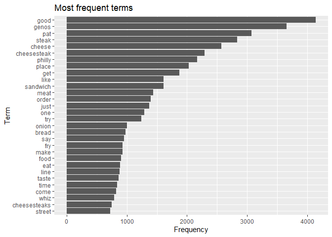
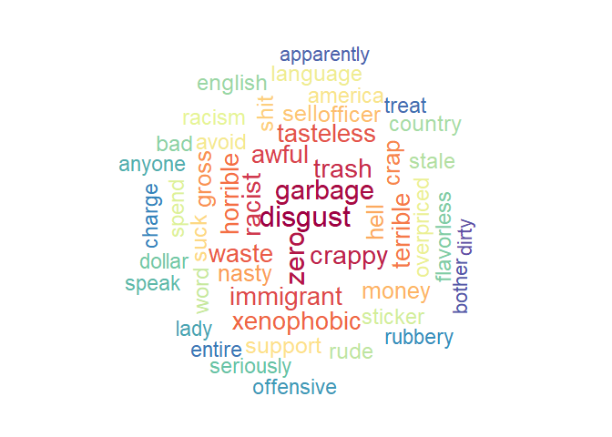
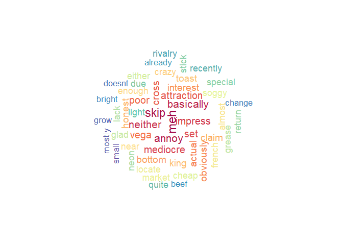
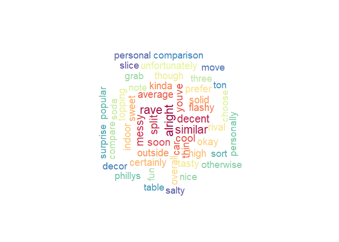
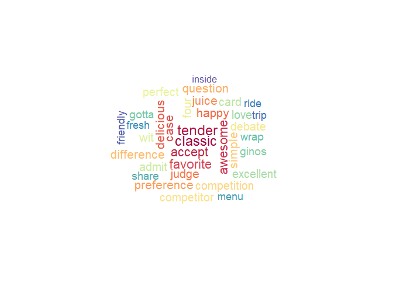
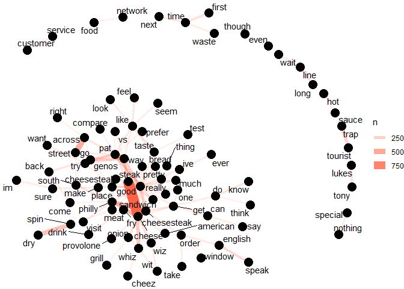
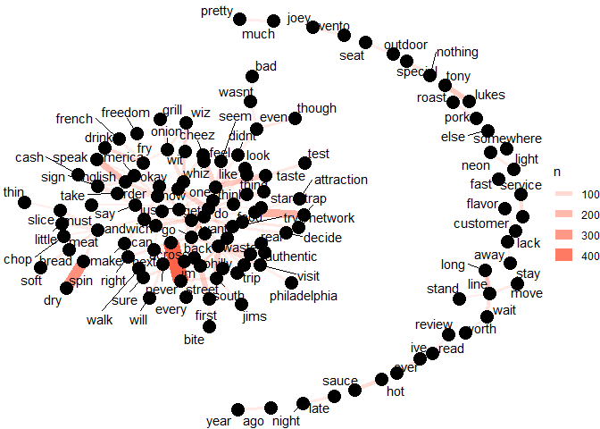

Using Text Mining Analysis to Make Suggestions to Improve the Rating of
a Poorly-Rated Business
================
Ng Chin Wen
2025-05-11

## 1. Introduction

### -

The dataset was sourced from Yelp (Yelp (n.d.)). In the initial
compressed file is another .tar file which contains the dataset. The
yelp_dataset.tar file contains 5 JSON files;
yelp_academic_dataset_business.json, yelp_academic_dataset_checkin.json,
yelp_academic_dataset_tip.json, yelp_academic_dataset_user.json,
yelp_academic_dataset_review.json, henceforth will be referred to as
business.json, checkin.json tip.json, user.json, review.json. However,
the main JSON files of concern are business.json, user.json, and
review.json.

The business.json contains information related to the business including
its location and some of its attributes. The reviews.json contains the
actual text of the reviews and its associated rating and other
information. The users.json contains information about Yelp’s userbase
including their friend network along with associated information about
votes and compliments submitted to that user by other users.

The files not used in this analysis are described as below: The
checkin.json contains businesses and a list of timestamps of each
checkin; check-ins are a way for people to keep track of places they’ve
visited to their friend network. The tip.json is similar to review.json,
but instead of a more involved text review, a tip is just more similar
to one-liners to convey a quick message.

Hive was used to store the large files (difficult or impossible to
store) and data exploration. Python was used to connect Hive to R in an
easy way and to have access to Python’s functionality. RStudio was used
for pre-processing, data analysis and visualisation. R Markdown was used
since its has more functionality and ease-of-use as a text editor
compared to Jupyter Notebook such as copy pasting images directly from
clipboard while having options to produce a HTML document or a Github
Document.

### 1.1 Objectives

- Use the Hadoop ecosystem to store, query and access the database into
  R.

- Identify top-rated businesses - determine which businesses receive the
  highest ratings overall, in specific categories (e.g., restaurants,
  cafes, hair salons), or in a location.

- Analyze customer sentiment based on Yelp reviews using text-based
  analysis, and make recommendations based on that.

### 1.2 Summary of business.json

Below is a summary of the original columns and the type of data that was
stored inside. For columns that were JSON object structures (struct),
they had to be expanded out as well.

| Name | Description | Data type |
|----|----|----|
| business_id | A 22-character string containing a uinque ID for the business - used to connect reviews, category | string |
| name | The name of the business | string |
| address | The address of the business | string |
| city | The city where the business is located | string |
| state | The state code where the business is located | string |
| postal code | The postal code where the business is located | string |
| latitude | The latitude of where the business is located | float |
| longitude | The longitude of where the business is located | float |
| stars | Average rating, rounded to half-stars | float |
| review_count | total number of reviews | float |
| is_open | Whether is it closed (0) or open (1) | boolean |
| attributes | Has several logical variables related | struct |
| categories | Related to what category the business is | string array |
| hours | Opening hours for each day of the week | struct |

### 1.3 Summary of review.json

| Name | Description | Data type |
|----|----|----|
| review_id | 22-character unique review ID | string |
| user_id | ID for the user that wrote the review - maps to user.json | string |
| business_id | ID of the business the review is for - maps to business.json | string |
| stars | Rating out of 5 | integer |
| date | Date the review was submitted | string |
| text | The actual review text itself | string |
| useful | Number of ‘useful’ votes received from other users | integer |
| funny | Number of ‘funny’ votes received from other users | integer |
| cool | Number of ‘cool’ votes received from other users | integer |

## 2. Data Storage and Set-Up

### 2.1 Data Storage Using Hadoop

Since reviews and users are very large (5GB and 3GB respectively), they
cannot easily be manipulated in R or Python. Because of those files in
particular, all JSON files were moved to the VirtualBox local folders
using [WinSCP](https://winscp.net/eng/download.php). Then all the files
were converted into Hive tables using Spark.

An example of a script using Spark.

``` sql
## To be run in the Virtual Machine
from pyspark.sql import SparkSession

spark = SparkSession.builder \
    .appName("JSON Schema Viewer") \
    .getOrCreate()
df = spark.read.json("C:/Users/Documents/a_ncw/2manage/yelp_academic_dataset_user.json")
df.write.mode("overwrite").saveAsTable("yelp_user")
```

For business.json, since it has some struct data types.

``` sql
## To be run in the Virtual Machine
from pyspark.sql import SparkSession
from pyspark.sql.types import StructType
from pyspark.sql.functions import col, split, explode, trim

spark = SparkSession.builder \
    .appName("JSON to Hive") \
    .enableHiveSupport() \
    .getOrCreate()

df=spark.read.json("hdfs:///user/maria_dev/yelp/yelp_academic_dataset_business.json")
def flatten(schema,prefix=None):
    fields=[]
    for field in schema.fields:
        name = prefix + '.' + field.name if prefix else field.name
        dtype=field.dataType
        if isinstance(dtype, StructType):
            fields += flatten(dtype, prefix=name)
        else:
            fields.append(name)
    return fields
df.write.mode("overwrite").saveAsTable("yelp_business")
```


Another example of checkin’s schema when turning the checkin json to a
hive table. 

However, the JSON file for yelp_reviews’ text file kept overflowing into
business_id or returning back blank. After reading around, \n newline
for Hive causes it to split it into a new line. Thus, to avoid this, all
in the text column for review.json was replaced by a space before it was
converted to a Hive table.

``` sql
## To be run in the Virtual Machine
from pyspark.sql import SparkSession
from pyspark.sql.functions import regexp_replace

spark = SparkSession.builder \
    .appName("JSON to Hive") \
    .enableHiveSupport() \
    .getOrCreate()

df_review = spark.read.json("hdfs:///user/maria_dev/yelp/yelp_academic_dataset_review.json")
df_review = df_review.withColumn("text",regexp_replace("text",r'\n',' '))

df_review.write.mode("overwrite").saveAsTable("yelp_review")
```

### 2.2 Setting up R

For my specific case, since I had made a conda environment made to the
hadoop framework, the conda environment within R also has to be set to
that.

``` r
reticulate::use_condaenv(condaenv = "C:\\Users\\PC05\\anaconda3\\envs\\ukm_stqd6324",required = TRUE)
```

Then after that, comes importing all the libraries, setting up a
connection can be made via python for Hive querying and R for any
further pre-processing and visualisation. Overall, after the data has
been properly converted to JSON to Hive table, the flow of the data is
Apache Hive -\> Python -\> R.

``` python
import pandas as pd
from impala.dbapi import connect

conn = connect(
    host='127.0.0.1',
    port=10000,
    user='maria_dev',
    database='default',
    auth_mechanism = 'PLAIN'
)
cursor = conn.cursor()

# A function was made to simplify converting Hive queries to pandas dataframes.
def to_pd(cursor):
  columns = [desc[0] for desc in cursor.description]
  data = cursor.fetchall()
  return pd.DataFrame(data, columns=columns)
```

When looking at all the databases stored in Hive, I uploaded the
following tables. The names match the name of aforementioned JSON files
described before. *yelp_business_category* is a table based on the
‘category’ column in yelp_business that was expanded and its
comma-separated list of categories pulled out.

``` python
cursor.execute('SHOW TABLES')
print(cursor.fetchall())
```

#### Example of querying

This is the extended description for yelp_business.

``` python
cursor.execute('DESCRIBE yelp_business')
print(cursor.fetchall())
```

After that, when we look at the columns for yelp_review:

``` python
cursor.execute('DESCRIBE yelp_review')
print(cursor.fetchall())
```

    ## [('business_id', 'string', ''), ('cool', 'bigint', ''), ('date', 'string', ''), ('funny', 'bigint', ''), ('review_id', 'string', ''), ('stars', 'double', ''), ('text', 'string', ''), ('useful', 'bigint', ''), ('user_id', 'string', '')]

When running `ANALYZE TABLE yelp_review COMPUTE STATISTICS;` in Ambari’s
Hive’s Query Editor and clicking Explain, we see that the number of
reviews is 6990280, matching the number of reviews as mentioned on the
Yelp website.


## 3.0 Choosing The Business

Packages used:

``` r
library(ggplot2)
library(tidyverse)
```

    ## ── Attaching core tidyverse packages ──────────────────────── tidyverse 2.0.0 ──
    ## ✔ dplyr     1.1.4     ✔ readr     2.1.5
    ## ✔ forcats   1.0.0     ✔ stringr   1.5.1
    ## ✔ lubridate 1.9.3     ✔ tibble    3.2.1
    ## ✔ purrr     1.0.2     ✔ tidyr     1.3.1
    ## ── Conflicts ────────────────────────────────────────── tidyverse_conflicts() ──
    ## ✖ dplyr::filter() masks stats::filter()
    ## ✖ dplyr::lag()    masks stats::lag()
    ## ℹ Use the conflicted package (<http://conflicted.r-lib.org/>) to force all conflicts to become errors

### 3.1 Average star rating for all businesses

Out of all the stars rating, only nine values are possible since Yelp
only displays it rounded to the nearest 0.5.

Overall, there is a left skew where most businesses are rated more
positively than negatively. The most common rating on average for a
particular business is around 4, followed by 4.5 and 3.0. The highest
rating only occurs around 10.8% of the time.

<!-- -->

The x-axis is the rating, the left y-axis points to the frequency of the
rating and the right y-axis is the average review count of a business
with that rating. The green is number of businesses with that star
rating and blue is average number of reviews for all businesses per star
rating.

As can be seen, it does not follow the same proportion for the
frequency. The top three highest average review counts are the same as
the business count, but the two lowest are 1.0 and 5.0, which shows that
most businesses with either a consistently high or low rating tend to
have fewer reviews. This suggests that extreme ratings are pushed
forward by a small number of reviews. As in, for example, if talking
about it in a generalised overview, while businesses with a high 5-star
rating would typically be seen as ‘better’ than those rated under 5, but
in actuality, taking in account the difference in average review count
vs rating, it could actually signify a business that is just niche or
new instead of better.

<!-- -->

### 3.2 Distribution of categories

Looking at the category column, there are a total of 1310 unique values
this could be. These columns are not distinct per business so a single
business could belong to multiple categories.

``` r
df<-reticulate::py$df
head(df)
```

    ##        category frequency
    ## 1   Restaurants     52268
    ## 2          Food     27781
    ## 3      Shopping     24395
    ## 4 Home Services     14356
    ## 5 Beauty & Spas     14292
    ## 6     Nightlife     12281

``` r
df<-reticulate::py$df
mean(df$frequency) #average is 509.9863
```

    ## [1] 509.9863

Around one third of businesses in this dataset is categorised under
Restaurant, followed by businesses related to Home Services, Beauty &
Spa, Nightlife and Health & Medical.

``` r
ggplot(df, aes(x = reorder(category, -frequency), y = frequency)) +
  geom_bar(stat = "identity") +
  labs(
    title = "Frequency of Business Categories",
    x = "Category",
    y = "Frequency"
  ) +
  theme_minimal() +
  coord_cartesian(xlim=c(0,50)) +
  theme(axis.text.x = element_text(angle = 90, hjust = 1))
```

<!-- -->

### 3.3 Distribution of review count

Looking at all businesses, it’s clear the review count is heavily
right-skewed. The max is 7568, while the minimum number of reviews is
only 5, yet the average number of reviews for any business in this
dataset is only around 45.

``` r
df<-reticulate::py$df
head(df)
```

    ##   review_count                               name         city
    ## 1         7568                  Acme Oyster House  New Orleans
    ## 2         7400                       Oceana Grill  New Orleans
    ## 3         6093 Hattie B’s Hot Chicken - Nashville    Nashville
    ## 4         5721            Reading Terminal Market Philadelphia
    ## 5         5193         Ruby Slipper - New Orleans  New Orleans
    ## 6         5185                Mother's Restaurant  New Orleans
    ##                                                                                                                                                                                                                                                                                                                                                                                                                                                                                                                categories
    ## 1                                                                                                                                                                                                                                                                                                                                                                                                                                                                       Live/Raw Food, Seafood, Restaurants, Cajun/Creole
    ## 2                                                                                                                                                                                                                                                                                                                                                                                                                                                                  Restaurants, Seafood, Cajun/Creole, Breakfast & Brunch
    ## 3                                                                                                                                                                                                                                                                                                                                                                                                                   American (Traditional), Chicken Shop, Southern, Restaurants, Chicken Wings, American (New), Soul Food
    ## 4 Candy Stores, Shopping, Department Stores, Fast Food, Beer, Wine & Spirits, Fruits & Veggies, Chinese, Food, Ice Cream & Frozen Yogurt, Desserts, Seafood, Health Markets, Bagels, Cheese Shops, Shopping Centers, Chocolatiers & Shops, Meat Shops, Public Markets, Food Court, Wineries, Local Flavor, Ethnic Food, Restaurants, Specialty Food, Arts & Entertainment, Juice Bars & Smoothies, Seafood Markets, Farmers Market, Coffee & Tea, Bakeries, Food Stands, Dinner Theater, Sporting Goods, Grocery, Fashion
    ## 5                                                                                                                                                                                                                                                                                                                                                                                                                                          Restaurants, American (Traditional), American (New), Cafes, Breakfast & Brunch
    ## 6                                                                                                                                                                                                                                                                                                                                                  Cajun/Creole, Restaurants, Event Planning & Services, Southern, Specialty Food, Soul Food, Food, Ethnic Food, American (New), Caterers, Breakfast & Brunch, Sandwiches

<!-- -->

Amazingly, around a third of businesses on Yelp do not even hit 10
reviews

``` r
sum(df$review_count < 10)
```

    ## [1] 51103

Overall, out of all the businesses that have at least 500 reviews are
mostly from the US, namely cities such as Philadelphia, New Orleans,
Nashville. This could be because they are well-known tourist
destinations. Since these cities attract many visitors throughout the
year, it most likely leads to a higher number of customers leaving
reviews for businesses (restaurants, hotels, tourist attractions, etc.).
However, take note that this Yelp dataset only covers 11 metropolitan
areas, which is why other popular tourism cities like New York do not
appear at all.

High foot traffic due to tourism and popular events (e.g., Mardi Gras in
New Orleans or music festivals in Philadelphia and Nashville) could be
contributing to the higher review count.

``` r
df<-reticulate::py$df
df2 <- df %>% filter(review_count > 500)
gg<-sort(table(df2$city), decreasing = TRUE)[1:20]
gg
```

    ## 
    ##     Philadelphia      New Orleans        Nashville            Tampa 
    ##              276              249              128               98 
    ##    Santa Barbara             Reno           Tucson      Saint Louis 
    ##               89               88               62               60 
    ##     Indianapolis Saint Petersburg            Boise Clearwater Beach 
    ##               59               14               12               12 
    ##       Clearwater    St Petersburg           Sparks           Goleta 
    ##               11               11               10                7 
    ##  King of Prussia         Metairie   St. Pete Beach          Dunedin 
    ##                7                7                7                6

<!-- -->

For New Orleans:

``` r
df<-reticulate::py$df
head(df)
```

    ##          ybc.business_id  ybc.category
    ## 1 W4ZEKkva9HpAdZG88juwyQ          Bars
    ## 2 W4ZEKkva9HpAdZG88juwyQ     Nightlife
    ## 3 W4ZEKkva9HpAdZG88juwyQ Cocktail Bars
    ## 4 W4ZEKkva9HpAdZG88juwyQ         Cafes
    ## 5 W4ZEKkva9HpAdZG88juwyQ  Cajun/Creole
    ## 6 W4ZEKkva9HpAdZG88juwyQ      Barbeque

For those with a high review count in New Orleans, the categories
associated with it is Cajun/Creole and Seafood, that is because those
two cuisines are associated with New Orleans or Louisiana in general. In
addition, Cajun/Creole is seafood-based.

    ## 
    ##               Restaurants              Cajun/Creole                   Seafood 
    ##                        82                        47                        36 
    ##                 Nightlife                      Bars        Breakfast & Brunch 
    ##                        26                        24                        24 
    ##                      Food            American (New)                Sandwiches 
    ##                        23                        22                        18 
    ##                  Southern             Cocktail Bars    American (Traditional) 
    ##                        18                        13                        11 
    ##                     Cafes Event Planning & Services                    French 
    ##                        11                         7                         6 
    ##           Hotels & Travel                Vegetarian      Arts & Entertainment 
    ##                         6                         6                         5 
    ##              Coffee & Tea                  Desserts 
    ##                         5                         5

For Nashville:

``` r
df<-reticulate::py$df
head(df)
```

    ##          ybc.business_id              ybc.category
    ## 1 ORL4JE6tz3rJxVqkdKfegA     Venues & Event Spaces
    ## 2 ORL4JE6tz3rJxVqkdKfegA                  Day Spas
    ## 3 ORL4JE6tz3rJxVqkdKfegA                   Resorts
    ## 4 ORL4JE6tz3rJxVqkdKfegA                    Cinema
    ## 5 ORL4JE6tz3rJxVqkdKfegA                    Hotels
    ## 6 ORL4JE6tz3rJxVqkdKfegA Event Planning & Services

For those with a high review count in Nashville, the categories
associated with it is similar to those in New Orleans with American and
Southern food.

    ## 
    ##               Restaurants                 Nightlife                      Bars 
    ##                        34                        23                        22 
    ##    American (Traditional)                  Southern            American (New) 
    ##                        18                        17                        13 
    ##                      Food        Breakfast & Brunch                  Barbeque 
    ##                        13                        11                         6 
    ##             Chicken Wings             Cocktail Bars                      Pubs 
    ##                         6                         6                         6 
    ##                Sandwiches      Arts & Entertainment                      Beer 
    ##                         5                         3                         3 
    ##                   Burgers                  Desserts Event Planning & Services 
    ##                         3                         3                         3 
    ##                   Lounges                   Mexican 
    ##                         3                         3

For Philadelphia:

``` r
df<-reticulate::py$df
head(df)
```

    ##          ybc.business_id ybc.category
    ## 1 vUrTGX_7HxqeoQ_6QCVz6g  Active Life
    ## 2 vUrTGX_7HxqeoQ_6QCVz6g     Lebanese
    ## 3 vUrTGX_7HxqeoQ_6QCVz6g Coffee & Tea
    ## 4 vUrTGX_7HxqeoQ_6QCVz6g  Restaurants
    ## 5 vUrTGX_7HxqeoQ_6QCVz6g    Nightlife
    ## 6 vUrTGX_7HxqeoQ_6QCVz6g         Food

For those with a high review count in Philadelphia, the categories
associated with it is similar to New Orleans and Nashville, with the
interesting difference being more Chinese/Asian and Italian food shops.

    ## 
    ##            Restaurants              Nightlife                   Bars 
    ##                     64                     21                     20 
    ##     Breakfast & Brunch                   Food American (Traditional) 
    ##                     19                     19                     18 
    ##         American (New)             Sandwiches                Chinese 
    ##                     17                     13                      9 
    ##           Cheesesteaks                Seafood         Specialty Food 
    ##                      8                      8                      8 
    ##          Cocktail Bars           Coffee & Tea                Italian 
    ##                      7                      7                      7 
    ##             Vegetarian           Asian Fusion                  Cafes 
    ##                      7                      6                      6 
    ##                 Diners                   Beer                Burgers 
    ##                      6                      5                      5 
    ##               Japanese           Local Flavor            Steakhouses 
    ##                      5                      5                      5 
    ##         Wine & Spirits 
    ##                      5

``` r
a<-reticulate::py$df
```

## 4.0 Text Mining Analysis

### -

For the purpose of utilising text mining analysis to provide service
improvements to a business, Geno’s Steaks with a rating of 2.5 was
chosen. Its reviews at various star ratings was examined and comments on
what is causing its low rating and recommendations to how to improve it
was made .

Packages used: tm, textstem, tidyverse, leaflet

### 4.1 Pre-processing

For text mining analysis, before deciding what to do, I wanted to limit
it to only businesses that are currently open and have at least 25
reviews to have enough substance to analyse. An issue faced by any
business is negative customer feedback; however, the ability to collect,
analyse and make changes based on those negative reviews would help a
business improve their quality of service. So, in Ambari Hive, I made a
new table or View based on the following:

``` sql
## To be run in as a Hive Query in Ambari
DROP VIEW bus_view;

CREATE VIEW bus_view AS
SELECT bb.business_id, bb.name, bb.review_count, bb.stars, bb.city, bb.latitude, bb.longitude, 
COUNT(CASE WHEN gg.stars = 1 THEN 1 END) AS count_star_1,
COUNT(CASE WHEN gg.stars = 2 THEN 1 END) AS count_star_2,
COUNT(CASE WHEN gg.stars = 3 THEN 1 END) AS  count_star_3,
COUNT(CASE WHEN gg.stars = 4 THEN 1 END) AS count_star_4,
COUNT(CASE WHEN gg.stars = 5 THEN 1 END) AS count_star_5
FROM yelp_business bb 
JOIN yelp_review gg ON bb.business_id = gg.business_id

WHERE bb.is_open = 1 AND bb.review_count >= 25
GROUP BY bb.business_id, bb.name, bb.review_count, bb.stars, bb.city, bb.latitude, bb.longitude;
```

Leaving 41679 businesses out of the original 150246.

``` python
cursor.execute("SELECT COUNT(*) from yelp_business")
print(cursor.fetchall()) #150246 rows
```

    ## [(150346,)]

``` python
cursor.execute("SELECT COUNT(*) from bus_view")
print(cursor.fetchall()) #41679 rows
```

    ## [(41679,)]

For picking a poorly reviewed business, since most businesses average
around 3-4 stars. I was interested in picking one that had a good
distribution of different ratings, high number of ratings overall, and
an average rating that was 2.5. Based on this, Geno’s Steaks’ reviews
will be analysed for this purpose.

    ##     bus_view.business_id                            bus_view.name
    ## 1 IkY2ticzHEn4QFn8hQLSWg                            Geno's Steaks
    ## 2 -QI8Qi8XWH3D8y8ethnajA Philadelphia International Airport - PHL
    ## 3 ve_-rPlEGPClytyJtY55Vw                     Nugget Casino Resort
    ## 4 rSYyGcZZziJLsqKl5hMcDw                       Circus Circus Reno
    ## 5 6zEWIsb6Lhr3BeoC3gm1lw                     Chickie's and Pete's
    ## 6 v1Uesklh8DpEufYOhTq4iA                  Mar Monte Hotel - Hyatt
    ##   bus_view.review_count bus_view.stars bus_view.city bus_view.latitude
    ## 1                  3401            2.5  Philadelphia          39.93384
    ## 2                  2149            2.5  Philadelphia          39.87307
    ## 3                  1576            2.5        Sparks          39.53318
    ## 4                  1249            2.5          Reno          39.53220
    ## 5                   787            2.5  Philadelphia          39.87742
    ## 6                   767            2.5 Santa Barbara          34.41769
    ##   bus_view.longitude bus_view.count_star_1 bus_view.count_star_2
    ## 1          -75.15881                  1001                   807
    ## 2          -75.24325                   600                   511
    ## 3         -119.75573                   753                   281
    ## 4         -119.81536                   365                   203
    ## 5          -75.24052                   254                   157
    ## 6         -119.66853                   266                   155
    ##   bus_view.count_star_3 bus_view.count_star_4 bus_view.count_star_5
    ## 1                   765                   505                   350
    ## 2                   579                   366                   179
    ## 3                   224                   229                   166
    ## 4                   301                   264                   159
    ## 5                   161                   147                    79
    ## 6                   109                   133                   121

Based on the various queries made in Section 3.3, there are 5 steakhouse
businesses in Philadelphia for this dataset in total. In truth, there
are other steakhouses in the larger Philadelphia area, however, Yelp
only includes a few metropolitan areas. Apart from Geno’s Steaks, the
others that are categorised as ‘steakhouses’ are Butcher and Singer,
Fogo de Chao Oyster House, Del Frisco’s Double Eagle Steakhouse. All of
them are rated at 4 except for Butcher and Singer which has a rating of
4.5.

    ##              yb.address  yb.alcohol
    ## 1        1500 Walnut St u'full_bar'
    ## 2      1337 Chestnut St  'full_bar'
    ## 3         1219 S 9th St      'none'
    ## 4        1516 Sansom St u'full_bar'
    ## 5 1428-1432 Chestnut St u'full_bar'
    ##                                                                                                                                                       yb.ambience
    ## 1  {'romantic': False, 'intimate': False, 'classy': True, 'hipster': False, 'divey': False, 'touristy': False, 'trendy': False, 'upscale': True, 'casual': False}
    ## 2 {'romantic': False, 'intimate': False, 'touristy': False, 'hipster': False, 'divey': False, 'classy': True, 'trendy': False, 'upscale': False, 'casual': False}
    ## 3    {'touristy': True, 'hipster': False, 'romantic': False, 'divey': None, 'intimate': False, 'trendy': False, 'upscale': False, 'classy': True, 'casual': None}
    ## 4  {'touristy': False, 'hipster': False, 'romantic': False, 'divey': False, 'intimate': False, 'trendy': True, 'upscale': False, 'classy': True, 'casual': False}
    ## 5  {'touristy': False, 'hipster': False, 'romantic': False, 'divey': False, 'intimate': False, 'trendy': False, 'upscale': True, 'classy': True, 'casual': False}
    ##   yb.byobcorkage yb.bikeparking yb.businessacceptscreditcards
    ## 1           <NA>          False                          True
    ## 2           'no'          False                          True
    ## 3     'yes_free'           True                         False
    ## 4           <NA>           True                          True
    ## 5           <NA>          False                          True
    ##                                                                    yb.businessparking
    ## 1 {'garage': False, 'street': True, 'validated': False, 'lot': False, 'valet': False}
    ## 2   {'garage': True, 'street': True, 'validated': False, 'lot': False, 'valet': True}
    ## 3  {'garage': False, 'street': True, 'validated': False, 'lot': True, 'valet': False}
    ## 4  {'garage': False, 'street': True, 'validated': True, 'lot': False, 'valet': False}
    ## 5   {'garage': True, 'street': True, 'validated': False, 'lot': False, 'valet': True}
    ##   yb.byappointmentonly yb.caters yb.coatcheck yb.corkage yb.dogsallowed
    ## 1                 <NA>     False         <NA>       <NA>          False
    ## 2                 <NA>      True         <NA>      False           <NA>
    ## 3                 <NA>     False         <NA>      False           True
    ## 4                False     False         <NA>       <NA>          False
    ## 5                False      True        False       <NA>          False
    ##   yb.goodforkids
    ## 1          False
    ## 2          False
    ## 3           True
    ## 4          False
    ## 5          False
    ##                                                                                               yb.goodformeal
    ## 1 {'dessert': False, 'latenight': False, 'lunch': None, 'dinner': True, 'brunch': False, 'breakfast': False}
    ## 2 {'dessert': False, 'latenight': False, 'lunch': None, 'dinner': True, 'brunch': False, 'breakfast': False}
    ## 3  {'dessert': False, 'latenight': True, 'lunch': True, 'dinner': None, 'brunch': False, 'breakfast': False}
    ## 4 {'dessert': False, 'latenight': False, 'lunch': None, 'dinner': True, 'brunch': False, 'breakfast': False}
    ## 5  {'dessert': None, 'latenight': False, 'lunch': None, 'dinner': True, 'brunch': False, 'breakfast': False}
    ##   yb.happyhour yb.hastv yb.noiselevel yb.outdoorseating yb.restaurantsattire
    ## 1        False    False    u'average'              True            u'dressy'
    ## 2         True    False    u'average'              True             'casual'
    ## 3        False     True    u'average'              True             'casual'
    ## 4         True    False    u'average'              True            u'casual'
    ## 5         True     True    u'average'              None            u'dressy'
    ##   yb.restaurantsdelivery yb.restaurantsgoodforgroups yb.restaurantspricerange2
    ## 1                   True                        True                         4
    ## 2                   True                        True                         4
    ## 3                   True                        True                         2
    ## 4                   True                        True                         3
    ## 5                   True                        True                         4
    ##   yb.restaurantsreservations yb.restaurantstableservice yb.restaurantstakeout
    ## 1                       True                       True                  True
    ## 2                       True                      False                  True
    ## 3                      False                      False                  True
    ## 4                       True                       True                  True
    ## 5                       True                       <NA>                  True
    ##   yb.wheelchairaccessible yb.wifi         yb.business_id
    ## 1                    True   u'no' 0oSSjekU-3GR8gselReWnA
    ## 2                    <NA>   u'no' cGX-1IUwXOjkUqZbkKYcjw
    ## 3                    True   u'no' IkY2ticzHEn4QFn8hQLSWg
    ## 4                    True   u'no' poviu-6n3iaRE4gdQz6OYw
    ## 5                    <NA> u'free' 4R2KR_-FybS7oegGrXjHVg
    ##                                                                     yb.categories
    ## 1                                Restaurants, Steakhouses, American (Traditional)
    ## 2                                    Seafood, Steakhouses, Brazilian, Restaurants
    ## 3                              Sandwiches, Cheesesteaks, Steakhouses, Restaurants
    ## 4                                               Restaurants, Steakhouses, Seafood
    ## 5 Food, Restaurants, Seafood, Specialty Food, Steakhouses, American (Traditional)
    ##        yb.city  yb.friday  yb.monday yb.saturday  yb.sunday yb.thursday
    ## 1 Philadelphia  16:0-21:0    0:0-0:0   17:0-23:0  17:0-22:0   17:0-22:0
    ## 2 Philadelphia 11:0-22:30 17:30-22:0 11:30-22:30 11:30-21:0  17:30-22:0
    ## 3 Philadelphia    0:0-0:0    0:0-0:0     0:0-0:0    0:0-0:0     0:0-0:0
    ## 4 Philadelphia 11:30-22:0       <NA>  11:30-22:0       <NA>  11:30-21:0
    ## 5 Philadelphia   17:0-0:0  17:0-21:0   15:0-20:0  16:0-21:0   17:0-22:0
    ##   yb.tuesday yb.wednesday yb.is_open yb.latitude yb.longitude
    ## 1  17:0-22:0    17:0-22:0          1    39.94933    -75.16618
    ## 2 17:30-22:0   17:30-22:0          1    39.95092    -75.16297
    ## 3    0:0-0:0      0:0-0:0          1    39.93384    -75.15881
    ## 4 11:30-21:0   11:30-21:0          1    39.95022    -75.16655
    ## 5  17:0-21:0    17:0-21:0          1    39.95096    -75.16546
    ##                                yb.name yb.postal_code yb.review_count yb.stars
    ## 1                   Butcher and Singer          19102            1290      4.5
    ## 2                         Fogo de Chao          19107            1426      4.0
    ## 3                        Geno's Steaks          19147            3401      2.5
    ## 4                         Oyster House          19102            1407      4.0
    ## 5 Del Frisco's Double Eagle Steakhouse          19102            1129      4.0
    ##   yb.state        ybc.business_id ybc.category
    ## 1       PA 0oSSjekU-3GR8gselReWnA  Steakhouses
    ## 2       PA cGX-1IUwXOjkUqZbkKYcjw  Steakhouses
    ## 3       PA IkY2ticzHEn4QFn8hQLSWg  Steakhouses
    ## 4       PA poviu-6n3iaRE4gdQz6OYw  Steakhouses
    ## 5       PA 4R2KR_-FybS7oegGrXjHVg  Steakhouses

Using business_id to obtain a dataframe with all the reviews.

For ease of use, run `read.csv("gen_rev.csv")` to get the dataset
directly to avoid needing to obtain it from hadoop. There are 3490
reviews.

There are two reviews that still have the newline causing issues. Since
it was just two (review_id: fRZGdiaCTbBkifuEz_klcw,
ooXvho4aODoq_ffOqtuYbA), I removed them. There were also two Chinese
reviews (review_id: 5IQ0ERyPZpuobdxHZAd7fA, uxRYoAM_eLWBHGPjIDkntQ) that
were removed since our analysis will be using English lexicons and
stopwords.

``` r
gen_rev <- gen_rev[!((is.na(gen_rev$yelp_review.user_id)) | (gen_rev$yelp_review.review_id %in% c('5IQ0ERyPZpuobdxHZAd7fA', 'uxRYoAM_eLWBHGPjIDkntQ'))), ]

gen_rev$yelp_review.date<-as.Date(gen_rev$yelp_review.date)
```

Next is preparing the corpus and removal of punctuation, numbers,
whitespace and common stopwords. Finally, the words were lemmatized.
Lemmatization uses a dictionary to reduce a word down to its root form
while preserving the word’s legibility. The other method of stemming is
similar but more destructive so it was not opted for.

    ## Loading required package: NLP

    ## 
    ## Attaching package: 'NLP'

    ## The following object is masked from 'package:ggplot2':
    ## 
    ##     annotate

    ## Loading required package: koRpus.lang.en

    ## Loading required package: koRpus

    ## Loading required package: sylly

    ## For information on available language packages for 'koRpus', run
    ## 
    ##   available.koRpus.lang()
    ## 
    ## and see ?install.koRpus.lang()

    ## 
    ## Attaching package: 'koRpus'

    ## The following object is masked from 'package:tm':
    ## 
    ##     readTagged

    ## The following object is masked from 'package:readr':
    ## 
    ##     tokenize

### 4.2 Exploratory Data Analysis

Looking at this, Geno’s Steaks is far away from the other steakhouses.
So, theoretically they have the advantage of being less competition.
However, the location of the other steakhouses seems to be nearer to a
city hall and a main transportation route while Geno’s Steaks is
comparatively out of the way.

<!-- -->

Aside from the month of 2019-07, the most popular period for reviews for
this business occurred from around mid 2013 to late 2014. The colours
correspond to the frequency, pink 0-10, orange 11-20, blue 21-30, yellow
31-40, black 41-50, red is 53.

<!-- -->

<!-- -->

5-star reviews have always lagged behind the others, growing at a
consistent rate. However, on the other hand, during the rush of reviews
during 2013-2014 mentioned before, the rates of other star ratings went
up with 1-star ratings going slightly more up compared to 2, 3, 4
rating.

``` r
df_cumsum <- gen_rev %>% mutate(review_month = format(gen_rev$yelp_review.date, "%Y-%m")) %>%
  count(review_month,yelp_review.stars) %>%
  pivot_wider(names_from = yelp_review.stars, values_from = n, values_fill = 0, names_prefix = "star_") %>%
  arrange(review_month) %>%
  mutate(across(starts_with("star_"), cumsum)) %>%
  pivot_longer(cols = starts_with("star_"),
               names_to = "star",
               names_prefix = "star_",
               values_to = "cum_count")%>% ungroup() %>% group_by(star) %>%
  mutate(star = factor(star), percent_cum = 100 * (cum_count / max(cum_count)))

#Cumulative sum of stra rating
ggplot(df_cumsum, aes(x = review_month, y = cum_count,color = star, group = star)) +
  geom_line(size = 1) +
  labs(
    title = "Cumulative Sum of Star Ratings Over Time",
    x = "Date",
    y = "Cumulative Count",
    color = "Star Rating"
  ) +
  scale_color_brewer(palette = "Set1") +
  theme_minimal()
```

<!-- -->

``` r
#Percentage cumulative
ggplot(df_cumsum, aes(x = review_month, y = percent_cum,color = star, group = star)) +
  geom_line(size = 1) +
  labs(
    title = "Cumulative Sum of Star Ratings Over Time",
    x = "Date",
    y = "Cumulative Count",
    color = "Star Rating"
  ) +
  scale_color_brewer(palette = "Set1") +
  theme_minimal()
```

<!-- -->

### 4.3 Analysis: Word Frequencies / Word Association

A Document-Term Matrix (DTM) is a table that represents the frequency of
terms or words in our collection of reviews. Based on the DTM, there are
9022 unique words.

``` r
library(tm)
dtm<-DocumentTermMatrix(docs)
dtm_df<-data.frame(cbind(as.matrix(dtm),gen_rev$yelp_review.stars))
names(dtm_df)[9023]<-"stars_rating"
dtm_df$stars_rating<-as.integer(dtm_df$stars_rating)

library(tidyverse)
#Frequency of words per star rating
d<-dtm_df %>% group_by(stars_rating) %>% summarise(across(everything(),sum)) %>% pivot_longer(cols = -stars_rating, names_to="term",values_to="freq") 

#Frequency of words overall
dtm_sum<- data.frame(names(colSums(as.matrix(dtm))),colSums(as.matrix(dtm)))
names(dtm_sum)<-c("term","freq")
```

#### Term Frequency

Across all documents, below are the most common words as in they appear
in the most number of documents. Those words are good, genos (referring
to the name of the business), pat (apparently a rival business), words
related to the food on the menu including ‘whiz’, a processed cheese
sauce for Philly cheesesteak, and philly (short for Philadelphia).

``` r
dtm_sum %>% arrange(desc(freq)) %>% head(30) %>% 
  ggplot(aes(x=freq, y=reorder(term,freq))) +
  geom_bar(stat="identity") +
  labs(
    title="Most frequent terms",
    y="Term",
    x="Frequency"
  )
```

<!-- -->

#### Wordcloud

For words with a frequency of at least 200, the key words are most
related to food or cooking terms (fry, provolone, onion), or the
location (Philly), although there are less nicer words like ‘bad’,
‘bland’, ‘rude’, ‘disappoint’, and ‘trap’.

``` r
library(wordcloud2)
wordcloud2(dtm_sum[dtm_sum$freq >=200,],size=0.7,shape="diamond",shuffle = FALSE)
```

<!-- -->

In order to capture the ‘unique’ words within a particular star rating,
the percent frequency was calculated where the word has appeared at
least 30 times over all reviews. Therefore, if a word has a higher
frequency in 1-star reviews compared to other star reviews, it will have
a higher proportion. For example, the word ‘disgust’ appears in 1-star
reviews 88% percent of the time, making it more unique to that. Apart
from negative descriptor words, other words that appear include
xenophobic, tasteless, overpriced, rubbery, racist, racism, rude,
flavorless, immigrant, stale.

``` r
library(wordcloud)
```

    ## Loading required package: RColorBrewer

``` r
d2 <- d %>% group_by(term) %>% 
  mutate(total = sum(freq)) %>% 
  mutate(percent_freq = round((freq/total)*100)) %>% 
     filter(total>=30) %>% slice_max(percent_freq, n = 1, with_ties = FALSE) %>% ungroup() %>% arrange(desc(percent_freq))
d3 <- d2 %>% filter(stars_rating == 1) %>% slice_head(n = 50)
wordcloud(
  words = d3$term,
  freq = d3$percent_freq,
  min.freq = 1,
  scale = c(2, 0.5),
  colors = colorRampPalette(brewer.pal(10, "Spectral"))(length(d3$term)),
  ordered.colors = T,
  random.order = FALSE,
  rot.per = 0.25
)
```

<!-- -->

Moving to the 2-star reviews, additional problems are being complained
about. Neon lights and food that is grease-y, cheap or soggy appear
here. The word ‘toast’ comes from feedback about upsettingly untoasted
bread.

``` r
d3 <- d2 %>% filter(stars_rating == 2) %>% slice_head(n = 50)
wordcloud(
  words = d3$term,
  freq = d3$percent_freq,
  min.freq = 1,
  scale = c(1.5, 0.5),
  colors = colorRampPalette(brewer.pal(10, "Spectral"))(length(d3$term)),
  ordered.colors = T,
  random.order = FALSE,
  rot.per = 0.25
)
```

<!-- -->

For 3-star ratings, words that are predominantly in it are becoming more
neutral.

``` r
d3 <- d2 %>% filter(stars_rating == 3) %>% slice_head(n = 50)
wordcloud(
  words = d3$term,
  freq = d3$percent_freq,
  min.freq = 1,
  scale = c(1.5, 0.5),
  colors = colorRampPalette(brewer.pal(10, "Spectral"))(length(d3$term)),
  ordered.colors = T,
  random.order = FALSE,
  rot.per = 0.25
)
```

<!-- -->

While it may be lacking in some respects, those who enjoyed their time
in Genos’ Steaks’ food is tender and a classic. The word ‘friendly’ also
appears here.

``` r
d3 <- d2 %>% filter(stars_rating == 4) %>% slice_head(n = 50)
wordcloud(
  words = d3$term,
  freq = d3$percent_freq,
  min.freq = 1,
  scale = c(1.5, 0.5),
  colors = colorRampPalette(brewer.pal(10, "Spectral"))(length(d3$term)),
  ordered.colors = T,
  random.order = FALSE,
  rot.per = 0.25
)
```

<!-- -->

For 5-star reviews, only 3 words are at 32, 30, and 26% out of the other
star ratings appear. Which means there isn’t any term that is
particularly unique in a 5 star rating that isn’t already appearing in a
4 star review or elsewhere.

``` r
d3 <- d2 %>% filter(stars_rating == 5) %>% slice_head(n = 50)
wordcloud(
  words = d3$term,
  freq = d3$percent_freq,
  min.freq = 1,
  colors = colorRampPalette(brewer.pal(10, "Spectral"))(length(d3$term)),
  ordered.colors = T,
  random.order = FALSE,
  rot.per = 0.25
)
```

<!-- -->

#### Word Correlations

As can be seen below, the top three words are heavily associated with
each other, with even ‘geno’ appearing in reviews often only when ‘pat’
is there too, most likely as a way to refer and differentiate them.
While ‘genos’ is more or less associated with food items, the word ‘pat’
is often appears in reviews together with words like ‘compare’,
‘comparison’, ‘either’, ‘difference’, ‘prefer’, ‘decide’, which tracks
with how it is often brought up in reviews as something reviewers
measure Geno’s Steaks to.

``` r
findAssocs(dtm,"good",0.2)
```

    ## $good
    ##       genos         pat         one cheesesteak        like      philly 
    ##        0.31        0.31        0.25        0.24        0.23        0.23 
    ##       steak       bread      cheese        make         get       order 
    ##        0.23        0.22        0.22        0.22        0.22        0.21 
    ##       place       think 
    ##        0.21        0.21

``` r
findAssocs(dtm,"genos",0.2)
```

    ## $genos
    ##          pat         good        steak  cheesesteak        order          one 
    ##         0.64         0.31         0.31         0.30         0.30         0.29 
    ##         meat       philly         also         make        onion         whiz 
    ##         0.28         0.27         0.27         0.26         0.26         0.26 
    ##          two          say          get       little     sandwich        bread 
    ##         0.26         0.26         0.25         0.24         0.24         0.23 
    ##         just         like          try         find        think       window 
    ##         0.23         0.23         0.23         0.23         0.23         0.23 
    ##        first philadelphia         bite       decide        slice       cheese 
    ##         0.23         0.23         0.22         0.22         0.22         0.21 
    ##      compare        right          eat          way       street         much 
    ##         0.21         0.21         0.21         0.21         0.21         0.20 
    ##       review         seem        since         chop 
    ##         0.20         0.20         0.20         0.20

``` r
findAssocs(dtm,"pat",0.2)
```

    ## $pat
    ##      genos       good        two    compare comparison       meat        one 
    ##       0.64       0.31       0.27       0.25       0.25       0.24       0.24 
    ##        try      steak     street       whiz     little      bread       seem 
    ##       0.24       0.24       0.24       0.24       0.23       0.22       0.22 
    ##     across     either       like      think difference      slice       chop 
    ##       0.22       0.21       0.21       0.21       0.21       0.21       0.21 
    ##     prefer     decide 
    ##       0.21       0.20

Compared to the top 3 words, many of the negative words aren’t as
heavily associated with another word, with those at a correlation limit
of around 0.1 to 0.2 usually only matching one or two reviews. For words
like ‘bad’, ‘rude’, and ‘disappoint’, it means those words are used
generally. Exceptions are the word ‘trap’ with the word ‘tourist’,
referring to the phrase ‘tourist trap’ to describe it. For ‘racist’ and
‘offensive’, both are associated with the word ‘sign’. The word ‘sign’
itself is also heavily associated with ‘english’, ‘speak’, ‘america’.

``` r
findAssocs(dtm,"bad",0.15)
```

    ## $bad
    ##        ever politicsand        even  genosyoull      shaker 
    ##        0.24        0.24        0.18        0.17        0.17

``` r
findAssocs(dtm,"disappoint",0.15)
```

    ## $disappoint
    ## orderlike  meatball 
    ##      0.17      0.16

``` r
findAssocs(dtm,"rude",0.15)
```

    ## $rude
    ##     lady    staff    logic shitload 
    ##     0.23     0.19     0.16     0.16

``` r
findAssocs(dtm,"trap",0.15)
```

    ## $trap
    ##      tourist dellesandros pennsyltucky     gristled 
    ##         0.55         0.18         0.18         0.18

``` r
findAssocs(dtm,"offensive",0.20)
```

    ## $offensive
    ##           bolt   chicagostyle       construe      giordanos       interpet 
    ##           0.33           0.33           0.33           0.33           0.33 
    ##       malnatis        soapbox         speech        stellar           sign 
    ##           0.33           0.33           0.26           0.24           0.23 
    ##          flair discriminatory            lou      outwardly         belief 
    ##           0.23           0.23           0.23           0.23           0.22

``` r
findAssocs(dtm,"racist",0.20)
```

    ## $racist
    ##       sign      speak       race   religion      owner       bely   cesspool 
    ##       0.26       0.26       0.26       0.26       0.25       0.25       0.25 
    ##     doubly     errand      false     gender  horsecrap   runowned       tale 
    ##       0.25       0.25       0.25       0.25       0.25       0.25       0.25 
    ##   thatthen    reserve propaganda    english      bigot   ignorant management 
    ##       0.25       0.24       0.23       0.23       0.22       0.22       0.22

``` r
findAssocs(dtm,"sign",0.25)
```

    ## $sign
    ##   english     speak   america    parent   foreign   country  language   dialect 
    ##      0.54      0.48      0.39      0.30      0.29      0.28      0.28      0.28 
    ##    insert immigrate    racist 
    ##      0.28      0.27      0.26

Unfortunately, specific words that could be associated with the food
items could not be drawn. Many of these scores from just one review.

``` r
findAssocs(dtm,"onion",0.25)
```

    ## $onion
    ##     order    cheese      whiz provolone     grill     genos  sandwich    remake 
    ##      0.34      0.33      0.31      0.30      0.30      0.26      0.26      0.26

``` r
findAssocs(dtm,"bread",0.2)
```

    ## $bread
    ##   meat   soft  chewy  genos  onion   good    pat cheese 
    ##   0.32   0.26   0.23   0.23   0.23   0.22   0.22   0.21

``` r
findAssocs(dtm,"toast",0.2)
```

    ## $toast
    ##     bleach      flour      olive indication     sponge 
    ##       0.33       0.33       0.33       0.23       0.23

``` r
findAssocs(dtm,"provolone",0.25)
```

    ## $provolone
    ## onion order  whiz 
    ##  0.30  0.27  0.25

``` r
findAssocs(dtm,"cheesesteak",0.25)
```

    ## $cheesesteak
    ##  genos philly  order    one    get 
    ##   0.30   0.30   0.28   0.27   0.25

``` r
findAssocs(dtm,"steak",0.25)
```

    ## $steak
    ##        cheese         genos         blasé   cheesegravy      creation 
    ##          0.52          0.31          0.26          0.26          0.26 
    ##    expedition        hunter       inhabit interestingly         kerry 
    ##          0.26          0.26          0.26          0.26          0.26 
    ##      montreal    possession     priscilla       procure   quasiracist 
    ##          0.26          0.26          0.26          0.26          0.26 
    ##           sam  scantilyclad  sequentially        skanky    steakeries 
    ##          0.26          0.26          0.26          0.26          0.26 
    ##         tammy    unmolested        uproar      vanessas 
    ##          0.26          0.26          0.26          0.26

``` r
findAssocs(dtm,"whiz",0.25)
```

    ## $whiz
    ##    cheese     onion     genos     order       wit provolone 
    ##      0.35      0.31      0.26      0.26      0.26      0.25

``` r
findAssocs(dtm,"flour",0.25)
```

    ## $flour
    ##       bleach        olive       sponge   complement     baguette unappetizing 
    ##         1.00         1.00         0.71         0.58         0.45         0.41 
    ##        toast      veggies  consistency        tooth 
    ##         0.33         0.32         0.29         0.27

#### Bigram Network

Bigrams are words that are next to each other in the text. However, in
this case, the text has been processed and its stopwords removed, some
of these ‘bigrams’ are not actually next to each other in the original
text, e.g. the bigram ‘bread meat’ may have originally been ‘bread and
meat’. When filtering for word pairs that appeared at least 50 times,
there are some phrases in here that pop up regularly in the reviews,
phrases such as ‘food network’ (referring to a TV show), ‘waste’ which
regularly occurs next to ‘(of) time’ and ‘(of) money’, ‘tourist trap’,
‘tony luke’ (another restaurant namedropped in reviews), ‘wait line
long’, ‘nothing special’, ‘speak english’.

Compared to the term frequency, using bigrams to analyse Yelp reviews
for Genos seems to accrue more meaningful keyword expressions at a
glance. Interestingly, a lot of the bigrams are to do with complaints
when ignoring the common words like the food and location names.
Reviewers seem to feel like Geno’s Steak is a tourist trap that is
nothing special, or even worse, a waste of time since you might have to
wait in line for a long time. It also highlights one major source of how
people hear about this restaurant through the TV food network show.

``` r
library(tidytext)
processed_text<- data.frame(text = docs, stringsAsFactors = FALSE)
gen_word_pairs_ori <- processed_text %>%
  unnest_tokens(bigram,text,token = "ngrams", n = 2) %>%
  count(bigram, sort = TRUE) %>% separate(bigram, c("word1", "word2"), sep = " ")
```

``` r
library(igraph)
```

    ## 
    ## Attaching package: 'igraph'

    ## The following objects are masked from 'package:lubridate':
    ## 
    ##     %--%, union

    ## The following objects are masked from 'package:dplyr':
    ## 
    ##     as_data_frame, groups, union

    ## The following objects are masked from 'package:purrr':
    ## 
    ##     compose, simplify

    ## The following object is masked from 'package:tidyr':
    ## 
    ##     crossing

    ## The following object is masked from 'package:tibble':
    ## 
    ##     as_data_frame

    ## The following objects are masked from 'package:stats':
    ## 
    ##     decompose, spectrum

    ## The following object is masked from 'package:base':
    ## 
    ##     union

``` r
library(ggraph)
gen_word_pairs_ori %>% 
  filter(n >= 50) %>% 
  graph_from_data_frame() %>%
  ggraph(layout = "kk") +
  geom_edge_link(aes(edge_alpha = n, edge_width = n),  edge_colour = "tomato") +
  geom_node_point(size = 5) +
  geom_node_text(aes(label = name), repel = TRUE, 
                 point.padding = unit(0.2, "lines")) +
  theme_void()
```

<!-- -->

After removing six frequent terms, the network redrawn’s nodes are more
visible, letting me lower the filter. Some were already apparent in the
previous network like ‘spin dry’, a cooking technique. Other than that,
typical common phrases like ‘pretty much’, ‘wasn’t bad’, ‘french fry’,
‘taste test’, ‘neon light’, ‘hot sauce’, ‘outdoor seat’, ‘somewhere
else’, ‘fast service’, ‘lack flavour’. Other bigrams that are readily
apparent to understanding include ‘joey vento’, the owner of Geno’s.

``` r
common_words<-c("cheese","steak","genos","pat","cheesesteak","good")
gen_word_pairs <- processed_text %>%
  unnest_tokens(bigram,text,token = "ngrams", n = 2) %>% 
  separate(bigram, c("word1", "word2"), sep = " ") %>%
  filter(!word1 %in% common_words,
         !word2 %in% common_words) %>%
  unite(bigram, word1, word2, sep = " ") %>%
  count(bigram, sort = TRUE) %>% separate(bigram, c("word1", "word2"), sep = " ")
gen_word_pairs %>% 
  filter(n >= 30) %>% #change this
  graph_from_data_frame() %>%
  ggraph(layout = "kk") +
  geom_edge_link(aes(edge_alpha = n, edge_width = n),  edge_colour = "tomato") +
  geom_node_point(size = 5) +
  geom_node_text(aes(label = name), repel = TRUE, 
                 point.padding = unit(0.2, "lines")) +
  theme_void()
```

<!-- -->

### 4.4 Analysis: Sentiment Analysis

#### Pre-processing

Bing is a lexicon scoring words either -1 for negative or 1 for
positive. AFINN is a lexicon of words scored between -5 to 5. NRC is a
lexicon that categorises words as positive or negative. It also has
words categorised as either The overall score for each is by finding the
total sum of all the words in a document or in a review in this case.

``` r
library(syuzhet)
library(tidyverse)
sen<-as.data.frame(cbind(gen_rev, syuzhet = get_sentiment(docs, method="syuzhet"), 
                         bing = get_sentiment(docs, method="bing"),
                         afinn = get_sentiment(docs, method="afinn"),
                         nrc = get_sentiment(docs, method="nrc"),get_nrc_sentiment(docs)))
```

#### Exploratory data analysis

All of them are distributed around the same range. Any slight
differences depends on how prolific each sentiment method’s dictionary
of words is and their scoring scale. For example, AFINN is between -5 to
5 so its x-axis has a much wider range compared to a smaller scoring
scale like Bing’s.

``` r
sen %>%
  pivot_longer(cols = c("syuzhet","bing", "afinn", "nrc"), names_to = "method", values_to = "score") %>%
  ggplot(aes(x = score, fill = method)) +
  geom_histogram(binwidth = 1, alpha = 0.7, position = "identity") +
  facet_wrap(~ method, scales = "free") +
  theme_minimal() +
  labs(title = "Distribution of Sentiment Scores", x = "Sentiment Score", y = "Frequency")
```

<!-- -->

#### Emotions Per Star Rating

Below is a radar chart which shows the variation per star rating for
each of the emotions. Red, orange, blue, yellow, purple correspond to
1-, 2-, 3-, 4-, and 5-star ratings respectively. The scales are
normalized by binding it in between each rating’s maximum value so it
can be directly plotted and shown on the same radar chart. Each polygon
represents the relative emotion score per star rating. The largest
difference is between 1-star reviews and then 3-, 4-, 5-star reviews.
For the negative emotions, 1 has comparativly higher numbers of words
related to disgust, anger, fear and sadness compared to 3, 4, 5, while 2
is approximately the midpoint. Positive emotions for 3, 4, 5, don’t look
too dissimilar.

``` r
library(fmsb)
emo_per_star <- sen %>%
  group_by(yelp_review.stars) %>%
  summarise(across(c(anger, disgust, fear, sadness, joy, surprise, anticipation, trust), sum, .names = "{.col}")) %>% rowwise() %>%
  mutate(total = sum(c_across(anger:trust))) %>%
  mutate(across(anger:trust, ~ .x / total * 100)) %>%
  ungroup() %>%
  select(-total) %>%
  arrange(yelp_review.stars)
rr <- rbind(rep(25,8), rep(0, 8), emo_per_star[,-1])
rownames(rr) <- c("Max", "Min", paste0("Star ", emo_per_star$yelp_review.stars))

radarchart(
  rr,
  axistype = 1,
  pcol =  c("red", "orange", "darkslategray1","yellow", "purple"),
  pfcol = adjustcolor( c("red", "orange", "darkslategray1","yellow", "purple"), alpha.f = 0.2),
  plwd = 2,
  plty = 1,
  cglcol = "grey",
  cglty = 1,
  axislabcol = "grey",
  vlcex = 0.9,
  title = "Emotions by Star Rating"
)
```

<!-- -->

#### Time Series of Average Sentiment over Time

``` r
sen %>% mutate(review_month = format(gen_rev$yelp_review.date, "%Y-%m")) %>%
  group_by(review_month) %>%
    summarise(
    avg_star = mean(yelp_review.stars, na.rm = TRUE),
    review_count = n()
  ) %>%
  ggplot(aes(x = review_month, y = avg_star, group = 1)) +
  geom_line() +
   theme(axis.text.x = element_text(angle = 90, hjust = 1)) +
  labs(title = "Average Rating Per Month Over Time", x = "Date", y = "Mean Rating")
```

<!-- -->

## 5.0 Discussion and Recommendations

The Yelp dataset is a massive file with the review.json being 5GB by
itself; this makes it extremely difficult or limiting to handle in a
software like R which defaults to handling objects in its environment in
RAM. This is one of the reasons what makes Yelp a suitable dataset to
have to load into a Hadoop ecosystem. In this assignment, putting it in
Hive lets us easily query and subset the tables we need directly.

After looking at the dataset overall using SQL to query various
characteristics, Geno’s Steaks was zeroed in on due to its very low
rating compared to the similar Philadelphian steakhouse restaurants in
the same area despite having very high number of reviews. This makes it
a welcome candidate to text analysis to process and handle it. Overall,
text mining analysis can be an effective way to process and visualise
thousands of lines of text in an informative way, limiting the need for
manual reading and examination. of all reviews. In addition, it allows
quantitatively words against each other for comparison.

For pinpointing reviews that mention or identify areas of improvement,
using a mix of different techniques of text analysis helps provide a
fuller image. Techniques done in this small assignment was term
frequency, word pairs, word correlations that could help find keywords.

Term frequency lets us see and compare what terms appear frequently
across all the reviews. Looking at it overall, most of the common words
was related to the business or to the food items; it wasn’t very helpful
for the objective of finding areas of improvement. However, once it was
narrowed to term frequencies per star rating, a clearer picture began to
form. Initially, I hoped to find unique words for 5-star ratings as
feedback for what the business should continue doing, however, there was
none. The most common words for 5-star reviews were the most common
words in general. Conversely, the lower-star ratings, especially the
1-star reviews had cited issues such as ‘rubbery’ meat, ‘stale’ and
‘tasteless’ food. The most significant issue and the most prominent
complaint for this business is related to perceived discriminatory,
xenophobic messaging, namely, a hotly mentioned issue is a sign to the
tone of, paraphrased, ‘To speak english, this is America’. If the
business is ever concerned about improving its rating on Yelp, resolving
that would be key. Apart from the usual improvement that could be made
to any food place like better food quality, and customer service,
another minor issue is the glaring neon lights. Overall, using term
frequency was a very effective way to narrow down keywords related to
customer grievances; however, the issue with using term frequency is
that it removes all context. If a word such as ‘friendly’ pops up a lot,
it would be initially difficult to determine if that is meant to be a
good thing or a bad thing (e.g. ‘not friendly’). Both ‘friendly’ and
‘not friendly’ would count towards the same. Another example is the word
‘trash’ appearing in the 1-star rating wordcloud. At first glance, it
could be a complaint about a messy restaurant, but ‘trash’ can also
appear as an adjective (‘this is trash’) or a verb (‘my friends always
trash this place to me’), so finding the original review is paramount.
Finally, wordcloud was used to colourfully communicate the frequency
using size and colour to denote it, however its output can be variable.
Based on that, it’s a nice overview, but not good for strict conveyance
of data.

Talking about context, word associations or word correlations examine
statistical relationships between words in a document. Words that appear
together frequently are said to have high correlation. While great in
theory, using in this context was difficult and many of the correlations
simply came from just one or two review mentioning together. Some words
would have the same level of correlation but differ in the number of
reviews that actually mention them together, so it impossible to
directly tell how many evidence there is. Also, in general, most of the
associations were very, very weak. Making recommendations for
improvement based on word correlations is of limited use. However, word
associations highlighted an intense rivalry between two steakhouses with
many of the reviews driven to comparing the two. In addition, using word
correlations together with term frequency allowed me identify the
existence of the restaurant’s signage that fueled the unique words in
the 1-star wordcloud.

Bigrams is similar to term frequency except instead of counting
frequency of just one word, it counts up the frequencies of pairs of
words. It provides slightly more context. Using this and adjusting the
bigram network, re-occuring words that appear adjacent to each other as
appear as a pattern. Projecting this method to a network graph allows
connections between words to be clearly illustrated like how common
words ‘line’ is connected to ‘wait’, ‘and’, ‘move’, ‘long’, ‘wait’, but
the ‘wait’ is ‘worth’ it which is also connected to ‘definitely’ (not
seen here). Compared to word associations, bigrams better capture a
local space, but it also means there is some superfluous bigrams that
reflect the english language’s phrasing rather than something something
specific to the dataset. Recommendations based on bigrams aren’t many,
in fact, this is the only method that finally drew some positive
feedback which is that they have ‘fast service’.


Recommendations to further improve insight into this include doing
sentiment analysis beyond just profiling the emotions associated a
certain rating.

### Literature

When comparing wordclouds, many of the words in the 1-star wordcloud and
the general overall wordcloud match the top 20 negative words in Las
Vegas, Nevada; words such as overpriced, soggy, rude, grease, and bland
but at least Geno’s Steaks isn’t associated with ‘closed’ or ‘dirty’ or
‘slow’, or ‘overcooked’ (based the negative word clouds for Charlotte
and Pittsburgh) (Wang and Qiu (2015)).

In other locations, 5-star reviews for quick server restaurants would be
related to the cleanliness of the business or the how friendly the staff
have been (Gadidov and Priestley (2018)). While there are some reviews
in our dataset mentioning that, it’s not a major theme. For staff, some
reviews for Geno’s Steaks mention friendliness and some are more mixed
or even stated to be downright rude.

Another paper that looks into also corroborates that the average review
for a user is very low, the majority being under 5 reviews. This could
be a factor why the average number of business is very low, most people
do not think to review every place they go to and only certain
circumstances like providing negative feedback may be driving them to
comment. For their wordcloud, it is for Gordon Ramsey’s BurGR. Their
positive wordcloud has terms related to the food items and positive
descriptors; the negative wordcloud has words like ‘waste’, ‘raw’,
‘nobody’ (Alamoudi and Al Azwari (2021)). In general, very similar to
the term frequencies for Genos’ Steaks 1-star and 5-star.

## References

<div id="refs" class="references csl-bib-body hanging-indent"
entry-spacing="0">

<div id="ref-alamoudi2021" class="csl-entry">

Alamoudi, Eman, and Sana Al Azwari. 2021. “Exploratory Data Analysis and
Data Mining on Yelp Restaurant Review.” In, 1–6.
<https://doi.org/10.1109/NCCC49330.2021.9428850>.

</div>

<div id="ref-gadidov2018" class="csl-entry">

Gadidov, Bogdan, and Jennifer Lewis Priestley. 2018. “Does Yelp Matter?
Analyzing (And Guide to Using) Ratings for a Quick Serve Restaurant
Chain.” In *Guide to Big Data Applications*, edited by S. Srinivasan,
503–22. Cham: Springer International Publishing.
<https://doi.org/10.1007/978-3-319-53817-4_19>.

</div>

<div id="ref-wang2015" class="csl-entry">

Wang, Mingshan, and Rui Qiu. 2015. “Text Mining for Yelp Dataset
Challenge.” In. <https://api.semanticscholar.org/CorpusID:41546427>.

</div>

<div id="ref-yelp" class="csl-entry">

Yelp. n.d. “Yelp Open Dataset.”
<https://business.yelp.com/data/resources/open-dataset/>.

</div>

</div>
